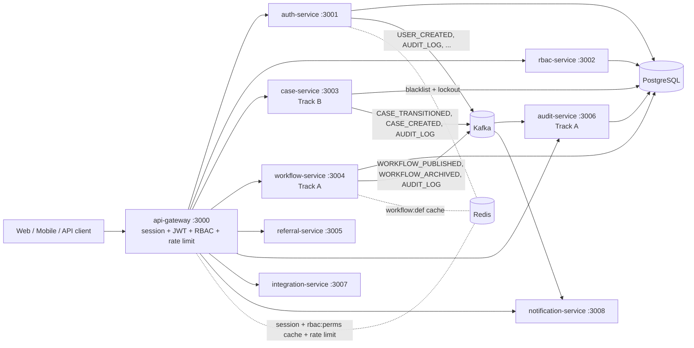
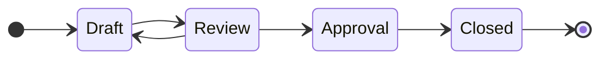
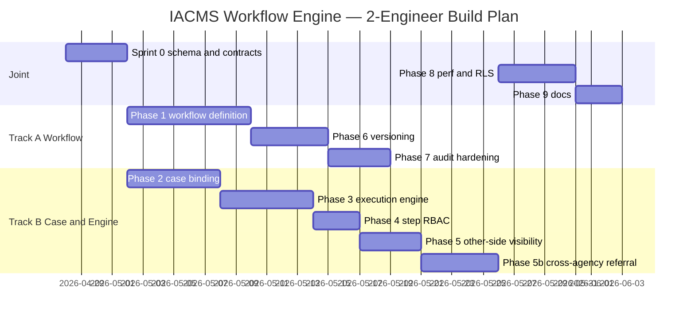
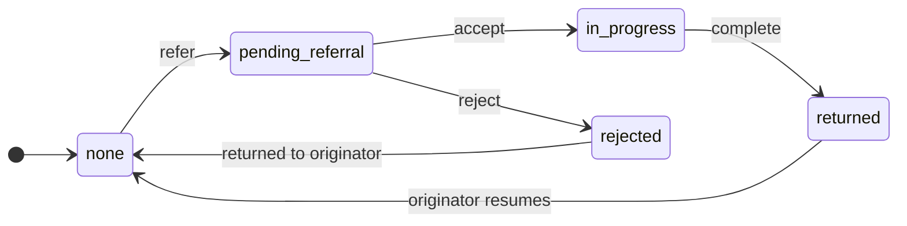

# IACMS — Phased Build Plan

**Multi-Tenant Dynamic Workflow Case Management System**

This is the live engineering roadmap for IACMS. It supersedes the historical narrative in [report.md](report.md) (which stays as the changelog of work already done).

The plan is split into a short **joint Sprint 0** that locks the schema and inter-service contracts, then runs as **two parallel tracks** (Track A — Workflow Platform, Track B — Case Lifecycle & Engine), converging again in joint Phases 8 and 9.

---

## Table of contents

1. [Executive summary](#1-executive-summary)
2. [Phase 0 — Foundation (DONE)](#2-phase-0--foundation-done)
3. [Parallel work plan (2 engineers)](#3-parallel-work-plan-2-engineers)
4. [Per-phase template](#4-per-phase-template)
5. [Phase 1 — Workflow Definition Schema and API](#5-phase-1--workflow-definition-schema-and-api-track-a)
6. [Phase 2 — Case Management with Workflow Binding](#6-phase-2--case-management-with-workflow-binding-track-b)
7. [Phase 3 — Workflow Execution Engine](#7-phase-3--workflow-execution-engine-track-b)
8. [Phase 4 — Step / Transition-Level RBAC](#8-phase-4--step--transition-level-rbac-track-b-with-track-a-touch)
9. [Phase 5 — Other-Side Visibility (intra-tenant)](#9-phase-5--other-side-visibility-track-b)
9b. [Phase 5b — Cross-Agency Referral and Visibility](#9b-phase-5b--cross-agency-referral-and-visibility-track-b)
10. [Phase 6 — Workflow Versioning](#10-phase-6--workflow-versioning-track-a)
11. [Phase 7 — Audit Service Hardening](#11-phase-7--audit-service-hardening-track-a)
12. [Phase 8 — Performance, Caching and Tenant Isolation](#12-phase-8--performance-caching-and-tenant-isolation-joint)
13. [Phase 9 — Documentation and Cleanup](#13-phase-9--documentation-and-cleanup-joint)
14. [Future / Deferred](#14-future--deferred)
15. [Cross-cutting policies](#15-cross-cutting-policies)
16. [Risks and mitigations](#16-risks-and-mitigations)
17. [Appendix A — Target Prisma schema diff](#17-appendix-a--target-prisma-schema-diff)
18. [Appendix B — API surface added](#18-appendix-b--api-surface-added)
19. [Appendix C — Sprint 0 contract document outline](#19-appendix-c--sprint-0-contract-document-outline)
20. [Conclusion](#20-conclusion)

---

## 1. Executive summary

IACMS is a multi-tenant case-management backend where each tenant defines its own workflow (steps + transitions) and the platform executes cases through that workflow. The platform must guarantee tenant isolation, role-aware step/transition permissions, full audit history, and "other side" visibility (who is responsible right now and what comes next) — see the spec sections 1, 2, 7, 9, 10.

The auth, gateway, RBAC scaffold, Kafka event bus, audit consumer, and email notification pipeline are already in place (see [Phase 0](#2-phase-0--foundation-done)). What remains is the actual workflow-driven core: a real workflow-definition schema, a transition engine, step-level RBAC, versioning, and the visibility/audit endpoints that hang off them.

### Target architecture



### Example workflows the platform must support



### Spec → phase mapping

| Spec section | Topic | Phase |
|---|---|---|
| 1.1, 1.2, 2.1 | Purpose, scope, three layers | Exec summary + Phases 1–5 |
| 3.1 | Tenant isolation (interim policy) | Phase 2 + cross-cutting |
| 3.1 | Tenant isolation (RLS decision) | Phase 8 |
| 4.1, 4.2, 4.3 | Tenant, User, Role | Phase 0 (done) |
| 4.4, 4.5, 4.6 | Workflow, Step, Transition | Phase 1 |
| 4.7 | Case | Phase 2 |
| 4.8 | Case History | Phase 1 rename + Phase 3 writes |
| 5.1, 5.3 | Workflow creation + invariants | Phase 1 |
| 5.2 | Example workflows | Exec summary mermaid |
| 6.1 | Case creation flow | Phase 2 |
| 6.2, 6.3 | Transition execution + validation | Phase 3 |
| 7.1, 7.2 | Other-side visibility (intra-tenant) | Phase 5 |
| 3.1, 7.1 | Cross-agency referral lifecycle and visibility | Phase 5b |
| 8 | Workflow versioning | Phase 6 |
| 9 | Step / transition RBAC | Phase 4 |
| 10 | Audit & logging | Phase 7 (Phase 0 already ships the consumer) |
| 13 | Notifications | Phase 0 (email) + [Future](#14-future--deferred) (WebSocket) |
| 15.1 | Scalability / indexes | Phase 8 |
| 15.2 | Security / tenant strictness | Phase 8 |
| 15.3 | Performance / caching | Phase 6 cache + Phase 8 |
| 17 | Risks | [Risks section](#16-risks-and-mitigations) |
| 18 | Conclusion | [Conclusion section](#20-conclusion) |

---

## 2. Phase 0 — Foundation (DONE)

Already shipped. Listed here so future contributors do not redo it. Details are in [report.md](report.md).

- **Auth** ([services/auth-service](services/auth-service)) — dual-strategy (session + JWT), Redis-backed JWT blacklist, 5-attempt account lockout, email verification, forgot/reset/change password, full admin user management (`listUsers`, `updateUser`, `assignRole`, `deactivate`, `reactivate`, `delete` with last-admin guard), `mustChangePassword` first-login enforcement, profile self-service.
- **Gateway** ([services/api-gateway](services/api-gateway)) — Express 5 with session middleware ([config/session.config.js](services/api-gateway/src/config/session.config.js) backed by Redis via `connect-redis`), JWT fallback in [middleware/auth.middleware.js](services/api-gateway/src/middleware/auth.middleware.js), Redis-backed RBAC permission cache in [middleware/rbac.middleware.js](services/api-gateway/src/middleware/rbac.middleware.js), Redis sliding-window rate limit in [middleware/rateLimit.middleware.js](services/api-gateway/src/middleware/rateLimit.middleware.js), reverse proxy for the 8 downstream services.
- **RBAC** ([services/rbac-service](services/rbac-service)) — role/permission CRUD plus `GET /permissions/user/:userId` consumed by the gateway cache.
- **Audit** ([services/audit-service](services/audit-service)) — Kafka consumer on `audit.log` writes to `AuditLog` table; basic `GET /audit` query API.
- **Notifications** ([services/notification-service](services/notification-service)) — Kafka consumers handle `USER_CREATED` (admin-only welcome), `EMAIL_VERIFICATION_REQUESTED`, `PASSWORD_RESET_REQUESTED`, `PASSWORD_CHANGED` via [src/utils/email.js](services/notification-service/src/utils/email.js) (nodemailer, Mailtrap in dev). Stub handlers exist for case/workflow/referral events; the email channel is fully implemented today and is preserved as-is by this plan.
- **Shared layer** — Kafka [shared/utils/eventBus.js](shared/utils/eventBus.js) with `TOPICS` enum, custom errors in [shared/common/errors.js](shared/common/errors.js), JSON logger in [shared/common/logger.js](shared/common/logger.js), error-handler middleware in [shared/middleware/errorHandler.js](shared/middleware/errorHandler.js).
- **Infra** — [infrastructure/docker-compose.yml](infrastructure/docker-compose.yml): postgres, redis, zookeeper, kafka, all 9 services with healthchecks.
- **Database** — [prisma/schema.prisma](prisma/schema.prisma) with 15 models, two migrations applied. **Note:** the existing `Workflow`, `WorkflowState`, and `Case.currentState` are placeholders that will be reshaped in Sprint 0.

What is **not** done and is explicitly the subject of this plan: real workflow-definition tables, transition engine, step/transition RBAC, workflow versioning, populated `AuditLog.oldValues/newValues`, "other-side" visibility API, workflow-definition cache, finalized tenant-isolation policy, refreshed docs.

---

## 3. Parallel work plan (2 engineers)

### 3.1 Sprint 0 — Schema and contracts lock-in (JOINT, ~3–5 days)

Both engineers pair on a single PR that ships everything that would otherwise create merge conflicts later. Once Sprint 0 is merged, the two tracks proceed independently.

**Sprint 0 deliverables:**

1. **Consolidated Prisma migration** `multi_tenant_workflow_engine` covering Phases 1, 2, 6, 7 schema additions. See [Appendix A](#17-appendix-a--target-prisma-schema-diff) for the full diff. One migration, both engineers sign off.
2. **HTTP / Kafka / error contracts** as a markdown document plus JSON example fixtures under a new `shared/contracts/` folder:
   - `shared/contracts/README.md` — index of all contracts.
   - `shared/contracts/workflow-full.contract.md` — shape of `GET /workflows/:id/full` and `GET /workflows/published?key=&tenantId=`.
   - `shared/contracts/__fixtures__/workflow-full.example.json` — canonical example used by Track A controller tests *and* Track B unit tests so the mock cannot drift from the real response.
   - `shared/contracts/audit-event.contract.md` + `shared/contracts/audit-event.schema.json` — JSON Schema for events on the `audit.log` topic; the audit-service consumer validates inbound events against it. Includes the optional `relatedTenantId` field used for cross-agency referrals.
   - `shared/contracts/case-transitioned.contract.md` — shape of the `case.transitioned` event.
   - `shared/contracts/referral-events.contract.md` + `shared/contracts/__fixtures__/referral.example.json` — shapes of the four `referral.*` events (Phase 5b). Each payload carries both `originatingTenantId` and `currentTenantId` so the notification-service can route to the right inbox on each side.
3. **Kafka topic additions** to `TOPICS` in [shared/utils/eventBus.js](shared/utils/eventBus.js):
   - `WORKFLOW_PUBLISHED = 'workflow.published'`
   - `WORKFLOW_ARCHIVED = 'workflow.archived'`
   - `CASE_TRANSITIONED = 'case.transitioned'`
   - `REFERRAL_CREATED = 'referral.created'`
   - `REFERRAL_ACCEPTED = 'referral.accepted'`
   - `REFERRAL_REJECTED = 'referral.rejected'`
   - `REFERRAL_COMPLETED = 'referral.completed'`
   - The existing `WORKFLOW_STATE_CHANGED` is deprecated but kept for one release; the contract doc declares `case.transitioned` as the canonical replacement. The four `REFERRAL_*` topics replace the inline strings currently used in [services/referral-service/src/controllers/referral.controller.js](services/referral-service/src/controllers/referral.controller.js).
4. **Shared error classes** added to [shared/common/errors.js](shared/common/errors.js):
   - `InvalidTransitionError` (400)
   - `WorkflowClosedError` (409)
   - `WorkflowNotPublishedError` (409)
   - `TenantMismatchError` (403)
   - `InvalidReferralStateError` (409) — used by Phase 5b when a referral is accepted twice, completed before being accepted, etc.
5. **Gateway header forwarding** updated in [services/api-gateway/src/middleware/auth.middleware.js](services/api-gateway/src/middleware/auth.middleware.js) to forward an `x-user-roles` header (comma-separated role IDs) so Phase 4's engine-time RBAC does not have to round-trip to rbac-service on every transition. The values come from the same fetch that already populates the gateway's `rbac:perms:*` cache.

6. **`AuditLog.relatedTenantId` column** added to the consolidated migration (in addition to all other Sprint 0 schema work). This enables Phase 7's `GET /audit/cases/:caseId` to surface a single chronological cross-agency timeline by OR-matching on `tenantId` and `relatedTenantId`. See [Appendix A](#17-appendix-a--target-prisma-schema-diff).

7. **Backfill `Case.currentTenantId`** in the consolidated migration. Today the column exists but is null for every case; the migration backfills `currentTenantId = tenantId` for every existing row so Phase 2's referral-aware queries (see 6.5) behave correctly from day one.

**Sprint 0 acceptance:**

- All 9 services start with `npm run docker:up` against the new schema.
- The seed script ([prisma/seed.js](prisma/seed.js)) is updated to populate one example workflow with steps and transitions for `TEST-ORG`.
- `shared/contracts/` is in place with at least one consumer of each contract (a stub test on each side that loads the fixture).
- Both engineers sign off on the migration.

### 3.2 Track A — Workflow Platform (Engineer A)

Owns [services/workflow-service](services/workflow-service), the workflow-definition cache in Redis, and the audit-service hardening. Coordinates with [services/rbac-service](services/rbac-service) for `allowedRoleIds` lookups.

| Phase | Track | Deliverable headline |
|---|---|---|
| Phase 1 | A | Real `WorkflowStep` and `WorkflowTransition` tables, validated CRUD, `GET /workflows/:id/full` |
| Phase 6 | A | Immutable published versions, `POST /workflows/:id/new-version`, Redis workflow-def cache |
| Phase 7 | A | Populate `oldValues`/`newValues`, `GET /audit/cases/:caseId`, `/audit/users/:userId/actions`, `/audit/compliance/:tenantId` |
| Phase 9 (half) | A | Workflow + audit + versioning sections of `docs/DOCUMENTATION.md`; new `IACMS_Workflow_API.postman_collection.json` |

### 3.3 Track B — Case Lifecycle and Engine (Engineer B)

Owns [services/case-service](services/case-service) and the gateway permission map. Pulls workflow definitions through Track A's contract.

| Phase | Track | Deliverable headline |
|---|---|---|
| Phase 2 | B | Case CRUD bound to a published workflow; `caseNumber` generator; referral-aware tenant scoping |
| Phase 3 | B | `POST /cases/:id/transitions/:transitionId/execute` engine; `CaseHistory` writes; `CASE_TRANSITIONED` event |
| Phase 4 | B (engine) + A (definition CRUD) | Engine-time check against `transition.allowedRoleIds`; gateway permission map entry |
| Phase 5 | B | `GET /cases/:id/state` returning current step + responsible roles + available actions + history (intra-tenant) |
| Phase 5b | B | Cross-agency referral lifecycle (`refer` / `accept` / `reject` / `complete`); transactional ownership transfer; `referral` block on `/cases/:id/state` |
| Phase 9 (half) | B | Case + referral + gateway + transition-engine sections of `docs/DOCUMENTATION.md`; updated Postman; updated [README.md](README.md) endpoints table |

### 3.4 Joint phases

- **Phase 8 — Performance & Tenant Isolation.** Indexes split per service (Track A authors workflow indexes, Track B authors case indexes), but the RLS-vs-explicit-clause decision is made together and the `shared/middleware/tenantContext.js` wrapper (if RLS is chosen) is co-authored.
- **Phase 9 — Documentation & Cleanup.** Each engineer writes the docs for their own surface; both review the other's PR; `report.md` becomes `docs/CHANGELOG.md`; `PHASES.md` (this file) becomes the live roadmap.

### 3.5 Synchronization points

1. **End of Sprint 0.** Schema merged, contracts in `shared/contracts/`, Kafka topics added, gateway forwards `x-user-roles`. Both tracks branch off independently.
2. **~Day 5 of Phase 1 / Phase 2.** Track A merges `GET /workflows/:id/full` to `main`. Track B replaces its mock with the real call. Until then Track B uses `shared/contracts/__fixtures__/workflow-full.example.json` verbatim.
3. **Start of Phase 4.** 30-minute sync to confirm `transition.allowedRoleIds[]` shape and that the gateway is forwarding `x-user-roles` end-to-end.
4. **Pre-Phase 8 review.** Both engineers walk the migration history together and confirm there are no orphaned columns left over from Sprint 0.

### 3.6 Timeline (sketch, not a commitment)



The Phase 8 trigger is updated accordingly: `Phase 8 perf and RLS` starts `after p5b p7` (was `after p5 p7`).

### 3.7 Risks specific to parallel work

| Risk | Mitigation |
|---|---|
| Schema drift between two parallel migrations | Sprint 0 ships **one** consolidated migration; both sign off before merge. |
| Mock vs real `GET /workflows/:id/full` divergence | Both sides import `shared/contracts/__fixtures__/workflow-full.example.json` verbatim in their tests. |
| Topic naming collision between deprecated `WORKFLOW_STATE_CHANGED` and new `CASE_TRANSITIONED` | Resolved in Sprint 0 contract doc; deprecated topic removed in Phase 9. |
| Gateway permission-map merge conflicts | Track B is the sole writer of new entries in [services/api-gateway/src/middleware/rbac.middleware.js](services/api-gateway/src/middleware/rbac.middleware.js) outside Sprint 0. |
| Audit producer/consumer payload drift | `audit-event.schema.json` validated by audit-service consumer (rejects malformed events with a warn-log); both producers and consumer are tested against the same schema fixture. |

---

## 4. Per-phase template

Every phase block in sections 5–13 follows this template:

- **Owner** — Track A / Track B / Joint.
- **Goal** — one sentence tied to a spec section.
- **Spec mapping** — numbered points from the spec this phase satisfies.
- **Depends on** — phases or Sprint 0 deliverables that must be merged first.
- **Database changes** — Prisma diff. (Most phases reference Sprint 0's consolidated migration rather than introducing their own.)
- **API surface** — endpoints with method, path, caller, and request/response shape.
- **Service code** — files to add or modify, with their full paths.
- **Events** — Kafka topics published or consumed.
- **Validation and business rules** — invariants the code must enforce.
- **Tests** — unit and integration files plus what they cover.
- **Acceptance criteria** — bullet list, "the phase is done when…".
- **Out of scope / deferred** — what is intentionally not in this phase.
- **Estimated effort** — S (1–2 days), M (3–5 days), L (≥1 week).

---

## 5. Phase 1 — Workflow Definition Schema and API (Track A)

- **Owner:** Track A.
- **Goal:** turn workflow definitions from a JSON blob into first-class, validated entities (Workflows, Steps, Transitions) so the engine in Phase 3 can rely on database invariants.
- **Spec mapping:** 4.4, 4.5, 4.6, 5.1, 5.3.
- **Depends on:** Sprint 0 consolidated migration; Sprint 0 contract for `GET /workflows/:id/full`.

### 5.1 Database changes (shipped in Sprint 0; this phase writes Prisma client code against them)

- Rename model `WorkflowState` → `CaseHistory` (table `case_history`, see Phase 1's mapping below).
- Add `WorkflowStep`: `id Uuid pk`, `workflowId Uuid fk`, `key String`, `name String`, `description String?`, `isInitial Boolean`, `isFinal Boolean`, `position Int`, `allowedRoleIds Uuid[]`, timestamps. Unique `(workflowId, key)`.
- Add `WorkflowTransition`: `id Uuid pk`, `workflowId Uuid fk`, `fromStepId Uuid fk`, `toStepId Uuid fk`, `name String`, `description String?`, `allowedRoleIds Uuid[]`, `requiresComment Boolean default false`, timestamps. Unique `(workflowId, fromStepId, name)`.
- Extend `Workflow`: add `key String`, `version Int default 1`, `status WorkflowStatus default DRAFT`, `publishedAt DateTime?`. Unique `(tenantId, key, version)`. Index `(tenantId, key, status)`.
- Add enum `WorkflowStatus { DRAFT PUBLISHED ARCHIVED }`.
- The existing `Workflow.definition Json` column is kept for one release as a frozen snapshot column for Phase 6's cache key — but new validation lives in the relational tables.

See [Appendix A](#17-appendix-a--target-prisma-schema-diff) for the full diff.

### 5.2 API surface (workflow-service)

| Method | Path | Caller | Body / Response |
|---|---|---|---|
| `GET` | `/workflows` | Gateway | `?status=&key=` filters; tenant-scoped; returns `{ workflows: [...] }` |
| `GET` | `/workflows/:id/full` | case-service, gateway | Returns `{ id, tenantId, key, version, status, steps:[...], transitions:[...] }`. **This is the contract frozen in Sprint 0** — do not break it. |
| `GET` | `/workflows/published?key=&tenantId=` | case-service | Returns the highest-version `PUBLISHED` workflow for that tenant + key, or 404. |
| `POST` | `/workflows` | Admin UI | Body `{ key, name, description }` → creates a `DRAFT` workflow with `version=1`. |
| `PUT` | `/workflows/:id` | Admin UI | Only allowed when `status='DRAFT'`. |
| `POST` | `/workflows/:id/steps` | Admin UI | Body `{ key, name, isInitial?, isFinal?, position?, allowedRoleIds[]? }`. Only on `DRAFT`. |
| `PUT` | `/workflows/:id/steps/:stepId` | Admin UI | Only on `DRAFT`. |
| `DELETE` | `/workflows/:id/steps/:stepId` | Admin UI | Only on `DRAFT`. Rejects if any transition references it. |
| `POST` | `/workflows/:id/transitions` | Admin UI | Body `{ name, fromStepId, toStepId, allowedRoleIds[]?, requiresComment? }`. Only on `DRAFT`. |
| `DELETE` | `/workflows/:id/transitions/:transitionId` | Admin UI | Only on `DRAFT`. |
| `POST` | `/workflows/:id/publish` | Admin UI | Validates invariants (see 5.4), flips `DRAFT` → `PUBLISHED`, sets `publishedAt`, publishes `WORKFLOW_PUBLISHED`. |

### 5.3 Service code

- Rewrite [services/workflow-service/src/controllers/workflow.controller.js](services/workflow-service/src/controllers/workflow.controller.js).
- Add `services/workflow-service/src/controllers/step.controller.js`.
- Add `services/workflow-service/src/controllers/transition.controller.js`.
- Add `services/workflow-service/src/utils/validators.js` (mirrors the pattern of [services/auth-service/src/utils/validators.js](services/auth-service/src/utils/validators.js)).
- Update [services/workflow-service/src/routes/workflow.routes.js](services/workflow-service/src/routes/workflow.routes.js).
- Add `services/workflow-service/src/services/invariants.js` containing `assertPublishable(workflow)` used by `/publish` and as a unit-tested function.

### 5.4 Validation and business rules

`assertPublishable(workflow)` enforces (spec §5.3):

1. Exactly one step has `isInitial=true`.
2. At least one step has `isFinal=true`.
3. Every transition's `fromStepId` and `toStepId` belong to the same workflow.
4. Every step (except final ones) has at least one outgoing transition (no dead-end mid-workflow steps).
5. Every step except the initial step is reachable from the initial step (BFS over transitions).
6. `allowedRoleIds[]` on every step and every transition references roles that exist in the same tenant (lookup via rbac-service or local Prisma if shared DB).
7. No circular transitions of zero length (i.e. `fromStepId === toStepId` is rejected unless explicitly flagged as a `selfLoop` — out of scope for this phase, so simply rejected).

Editing rules:

- All write endpoints reject with 409 `WorkflowClosedError` when the workflow is not `DRAFT`.
- Tenant-scope every query: `where: { tenantId: req.headers['x-tenant-id'] }`.

### 5.5 Events

- **Publishes** `WORKFLOW_PUBLISHED` on successful publish. Payload: `{ workflowId, tenantId, key, version, publishedAt }`.
- **Publishes** `AUDIT_LOG` for every CRUD action on workflows/steps/transitions.

### 5.6 Tests

- `services/workflow-service/tests/unit/invariants.test.js` — pure tests for `assertPublishable` covering each of the seven rules.
- `services/workflow-service/tests/integration/workflow.crud.test.js` — full CRUD against real Postgres via supertest, using the seed tenant.
- `services/workflow-service/tests/integration/workflow.publish.test.js` — happy path + every rejection path; asserts that `PUT /workflows/:id` is rejected with 409 once published.
- `services/workflow-service/tests/integration/workflow.full.contract.test.js` — loads `shared/contracts/__fixtures__/workflow-full.example.json` and asserts the response shape conforms.

### 5.7 Acceptance criteria

- A draft workflow can be created, given steps and transitions, and published only when all seven invariants hold.
- A published workflow rejects all edits.
- `GET /workflows/:id/full` returns the exact contract shape; case-service can use it without further transformation.
- Seed script populates one example workflow (`Draft → Review → Approval → Closed`) for `TEST-ORG`.

### 5.8 Out of scope

- Versioning workflow (Phase 6).
- Workflow visual designer UI.
- `selfLoop` / `cycle` transitions.

### 5.9 Effort

L (~8 days).

---

## 6. Phase 2 — Case Management with Workflow Binding (Track B)

- **Owner:** Track B.
- **Goal:** rebuild case CRUD so every case is bound to an exact published workflow version, with a deterministic tenant-scoped case number, and with explicit tenant filtering on every query.
- **Spec mapping:** 4.7, 6.1, 3.1.
- **Depends on:** Sprint 0 schema. Can start day 1 against `shared/contracts/__fixtures__/workflow-full.example.json`; swaps to the real `GET /workflows/:id/full` once Track A merges Phase 1 step 1 (Sync Point 2).

### 6.1 Database changes (shipped in Sprint 0)

- On `Case`:
  - Drop string `currentState`.
  - Add `currentStepId Uuid` FK → `WorkflowStep.id` (nullable initially, backfilled by migration to the workflow's initial step).
  - Add `workflowVersion Int` (snapshot at creation time).
  - Add `caseNumber String` unique-per-tenant.
  - Add `closedAt DateTime?` to make "is the case in a final step?" queries cheap (denormalised, set by Phase 3 engine).
- Add unique index `(tenantId, caseNumber)`.
- Add Postgres sequence `case_number_seq_<tenantId>` lazily created on first case in each tenant (or simpler: a single `case_sequences` table with `(tenantId, year, lastSeq)` and a row-lock-based bump). The latter is preferred for portability — see 6.4.

### 6.2 API surface (case-service)

| Method | Path | Caller | Body / Response |
|---|---|---|---|
| `GET` | `/cases` | Gateway | `?workflowKey=&status=&assignedTo=&page=&pageSize=` filters; tenant-scoped. |
| `GET` | `/cases/:id` | Gateway | Returns case with `currentStep` joined. |
| `POST` | `/cases` | Gateway | Body `{ workflowKey, title, description?, data?, priority? }`. Resolves the **published** workflow with that key for the caller's tenant; creates the case at the workflow's initial step. |
| `PUT` | `/cases/:id` | Gateway | Body restricted to `{ title?, description?, data?, priority? }`. **Never** touches `currentStepId` (only the engine in Phase 3 does). |
| `DELETE` | `/cases/:id` | Gateway | Soft delete. Rejected if the case is not in a final step (use `currentStep.isFinal`). |

### 6.3 Service code

- Rewrite [services/case-service/src/controllers/case.controller.js](services/case-service/src/controllers/case.controller.js).
- Add `services/case-service/src/services/workflow.client.js` — a thin client around `GET /workflows/:id/full` and `GET /workflows/published`. In tests it returns `shared/contracts/__fixtures__/workflow-full.example.json` directly.
- Add `services/case-service/src/utils/case-number.js` — sequence-based generator (see 6.4).
- Add `services/case-service/src/utils/validators.js` for body shapes.

### 6.4 Case-number generator

Format: `{tenantCode}-{YYYY}-{seq:0>5}` (e.g. `TEST-ORG-2026-00042`).

Implementation in `case-number.js`:

```js
// Inside a Prisma transaction with FOR UPDATE row lock
const seqRow = await tx.caseSequence.upsert({
  where: { tenantId_year: { tenantId, year } },
  update: { lastSeq: { increment: 1 } },
  create: { tenantId, year, lastSeq: 1 },
});
return `${tenantCode}-${year}-${String(seqRow.lastSeq).padStart(5, '0')}`;
```

Requires a new `CaseSequence` model in Sprint 0's migration: `tenantId Uuid`, `year Int`, `lastSeq Int`, primary key `(tenantId, year)`.

### 6.5 Tenant scoping (interim policy, referral-aware)

This phase commits to the **explicit `where: { ... }` per query** policy as the interim approach. Every Prisma call in [services/case-service](services/case-service) reads `req.headers['x-tenant-id']` from the gateway-forwarded header and applies it via the helper `tenantScope(callerTenantId, mode)`:

- **`mode: 'read'`** (used by `GET /cases`, `GET /cases/:id`, `GET /cases/:id/state`, `GET /cases/:id/history`):
  ```js
  where: {
    OR: [
      { tenantId:            callerTenantId }, // legacy/owner column (kept until Phase 8 migration)
      { currentTenantId:     callerTenantId }, // case is currently held by me (incoming referral)
      { originatingTenantId: callerTenantId }, // I sent it; I keep read-only visibility
    ],
  }
  ```
- **`mode: 'write'`** (used by `PUT /cases/:id`, `DELETE /cases/:id`, and the Phase 3 transition engine): only the agency currently holding the case can mutate it.
  ```js
  where: { id, currentTenantId: callerTenantId }
  ```
  A write attempt by the originating agency on a case currently held by another agency returns 403 with `TenantMismatchError` and the message `"Case is currently held by another tenant; you have read-only access until it is returned."`

This is the policy referenced by Phase 5b's referral lifecycle. The RLS-vs-explicit-clause decision in Phase 8 supersedes the implementation but keeps the same logical rule (RLS policy expression: `current_tenant_id = current_setting('app.current_tenant_id') OR originating_tenant_id = current_setting('app.current_tenant_id')` for read; tighter for write).

A tenant ID mismatch on a route param (e.g. `GET /cases/:id` where the case belongs to a tenant the caller has neither originated nor is currently holding) returns 404 — a deliberate choice to avoid leaking case existence across tenants.

### 6.6 Events

- **Publishes** `CASE_CREATED` (already in `TOPICS`) on creation. Payload: `{ caseId, tenantId, workflowId, workflowVersion, caseNumber, currentStepId, actorId }`.
- **Publishes** `CASE_UPDATED` on PUT.
- **Publishes** `AUDIT_LOG` on create / update / delete.
- The existing inline strings (`'case.created'`, `'case.updated'`) in the current controller are replaced with `TOPICS.CASE_CREATED` / `TOPICS.CASE_UPDATED`.

### 6.7 Validation and business rules

- `workflowKey` must resolve to a `PUBLISHED` workflow for the caller's tenant; otherwise 409 `WorkflowNotPublishedError`.
- `data` (Json) is accepted as-is — no schema enforcement at this phase (out of scope; possible future phase).
- PUT cannot transition the case (no `currentStepId` in the body shape).
- DELETE rejected when `currentStep.isFinal === false`.

### 6.8 Tests

- `services/case-service/tests/unit/case-number.test.js` — concurrency test: 100 parallel inserts produce 100 distinct sequence numbers.
- `services/case-service/tests/integration/case.crud.test.js` — create/read/update/soft-delete with mocked `workflow.client.js` returning the fixture, then a second pass with the real client once Track A is merged.
- `services/case-service/tests/integration/case.tenant-scope.test.js` — covers all three referral-aware paths:
  1. caller from tenant A reads/updates a case owned by tenant A — 200.
  2. caller from tenant A reads a case originating in A but currently held by B — 200 (read-only); a PUT on the same case returns 403 `TenantMismatchError`.
  3. caller from tenant A reads a case with no relation to A — 404.

### 6.9 Acceptance criteria

- A user creates a case by `workflowKey`; the case lands in the workflow's initial step with the correct `workflowVersion` snapshot and a unique `caseNumber`.
- `PUT /cases/:id` cannot change `currentStepId`.
- `DELETE /cases/:id` rejected unless the case is closed.
- All queries are tenant-scoped; cross-tenant access returns 403.

### 6.10 Out of scope

- The transition engine (Phase 3).
- Attachment upload (existing skeleton stays as-is).
- `data` schema validation per workflow.

### 6.11 Effort

M (~6 days).

---

## 7. Phase 3 — Workflow Execution Engine (Track B)

- **Owner:** Track B.
- **Goal:** make state changes happen exclusively through one validated, transactional endpoint that writes a `CaseHistory` row for every transition.
- **Spec mapping:** 6.2, 6.3, 4.8, 10 (audit producer half).
- **Depends on:** Phase 2 (case schema), Phase 1 merged so workflows + steps + transitions can be populated by tests.

### 7.1 Database changes

None new — uses Sprint 0's `CaseHistory` (renamed from `WorkflowState`) and `Case.currentStepId`.

`CaseHistory` final shape after Sprint 0 rename:

| Column | Type | Notes |
|---|---|---|
| `id` | Uuid | PK |
| `caseId` | Uuid | FK Case |
| `tenantId` | Uuid | denormalised for tenant scoping + index |
| `transitionId` | Uuid? | FK WorkflowTransition (nullable for case creation row) |
| `fromStepId` | Uuid? | nullable for the initial creation history row |
| `toStepId` | Uuid | required |
| `actorId` | Uuid | the user that performed the transition |
| `comment` | String? | required iff transition.requiresComment |
| `transitionedAt` | DateTime | default now |

### 7.2 API surface (case-service)

| Method | Path | Caller | Body / Response |
|---|---|---|---|
| `POST` | `/cases/:id/transitions/:transitionId/execute` | Gateway | Body `{ comment? }`. Returns the updated case. |
| `GET` | `/cases/:id/history` | Gateway | Returns `[{ at, actor, fromStep, toStep, comment }]`. (Used in Phase 5 too; lives in the engine here.) |

### 7.3 Engine logic — `services/case-service/src/services/transition.engine.js`

Pseudo-flow:

```
async function executeTransition({ caseId, transitionId, actor, comment }) {
  return await prisma.$transaction(async (tx) => {
    const c = await tx.case.findUnique({
      where: { id: caseId },
      include: { currentStep: true },
    });
    assertSameTenant(c, actor);

    const t = await tx.workflowTransition.findUnique({
      where: { id: transitionId },
      include: { fromStep: true, toStep: true },
    });

    if (!t || t.workflowId !== c.workflowId) throw new InvalidTransitionError();
    if (c.currentStep.isFinal) throw new WorkflowClosedError();
    if (t.fromStepId !== c.currentStepId) throw new InvalidTransitionError();
    if (t.requiresComment && !comment) throw new ValidationError('Comment required');

    assertActorHasRole(actor, t.allowedRoleIds);

    const updated = await tx.case.update({
      where: { id: caseId, currentStepId: c.currentStepId }, // optimistic concurrency
      data: {
        currentStepId: t.toStepId,
        closedAt: t.toStep.isFinal ? new Date() : null,
      },
    });

    await tx.caseHistory.create({
      data: {
        caseId,
        tenantId: c.tenantId,
        transitionId,
        fromStepId: c.currentStepId,
        toStepId: t.toStepId,
        actorId: actor.id,
        comment,
      },
    });

    return updated;
  });
}
```

After the transaction commits, publish `CASE_TRANSITIONED` and `AUDIT_LOG` (outside the DB transaction so Kafka latency does not block the row lock).

### 7.4 Validation and business rules

- Transition belongs to the case's workflow (`transition.workflowId === case.workflowId`). If not, 400 `InvalidTransitionError`.
- Transition starts at the case's current step (`transition.fromStepId === case.currentStepId`). If not, 400 `InvalidTransitionError`.
- Case is not already in a final step. If it is, 409 `WorkflowClosedError`.
- If `transition.requiresComment` is true, `comment` is non-empty.
- Actor has at least one role in `transition.allowedRoleIds` (Phase 4 plugs in here; Phase 3 ships with the check using gateway-forwarded `x-user-roles`).
- Optimistic concurrency: the `update` includes `currentStepId: c.currentStepId` in `where`, so two concurrent transitions on the same case will race-fail with Prisma's "record not found" — the loser returns 409 `InvalidTransitionError`.

### 7.5 Events

- **Publishes** `CASE_TRANSITIONED` (new in Sprint 0). Payload conforms to `shared/contracts/case-transitioned.contract.md`:

  ```json
  {
    "caseId": "uuid",
    "tenantId": "uuid",
    "workflowId": "uuid",
    "workflowVersion": 1,
    "transitionId": "uuid",
    "transitionName": "approve",
    "fromStepId": "uuid",
    "fromStepName": "Review",
    "toStepId": "uuid",
    "toStepName": "Approval",
    "isFinal": false,
    "actorId": "uuid",
    "comment": "looks good",
    "transitionedAt": "2026-04-28T10:15:00Z"
  }
  ```

- **Publishes** `AUDIT_LOG` with `entityType:'case'`, `action:'transitioned'`, and `oldValues`/`newValues` populated from `fromStepId` / `toStepId` (this is also the Phase 7 audit-producer change).

### 7.6 Service code

- Add `services/case-service/src/services/transition.engine.js` (the function above).
- Add `services/case-service/src/controllers/transition.controller.js` exposing `POST /cases/:id/transitions/:transitionId/execute`.
- Add `services/case-service/src/controllers/history.controller.js` exposing `GET /cases/:id/history`.
- Update [services/case-service/src/routes/case.routes.js](services/case-service/src/routes/case.routes.js).
- Update [shared/common/errors.js](shared/common/errors.js) with the new error classes (Sprint 0).

### 7.7 Tests

- `services/case-service/tests/unit/transition.engine.test.js` — happy path; wrong tenant; wrong fromStep; closed case; comment-required; missing role; concurrent transition (last-write race using two awaited promises).
- `services/case-service/tests/integration/transition.execute.test.js` — full HTTP path through the case-service Express app, asserting the case row, the `CaseHistory` row, and the published Kafka event.

### 7.8 Acceptance criteria

- A user with the right role can move a case along a valid transition; a `CaseHistory` row is written; `CASE_TRANSITIONED` is published.
- All six validation rules in 7.4 are enforced and tested.
- Two concurrent transition requests cannot both succeed; the loser receives 409.

### 7.9 Out of scope

- Step-RBAC reads (handled in Phase 4 by joining gateway-forwarded `x-user-roles`).
- Notifications on transition (consumed by [services/notification-service](services/notification-service); this phase publishes the event, the email/in-app handler is outside this plan beyond what already exists).

### 7.10 Effort

M-L (~6 days).

---

## 8. Phase 4 — Step / Transition-Level RBAC (Track B with Track A touch)

- **Owner:** Track B (engine integration), Track A already shipped the `allowedRoleIds[]` schema and CRUD validation in Phase 1.
- **Goal:** enforce that only users with one of the allowed roles can execute a transition, in addition to the existing route-level RBAC at the gateway.
- **Spec mapping:** 9.
- **Depends on:** Phase 3 engine; Sprint 0's `x-user-roles` header forwarding.

### 8.1 Decision: two-layer RBAC

- **Route-level (gateway):** the existing [services/api-gateway/src/middleware/rbac.middleware.js](services/api-gateway/src/middleware/rbac.middleware.js) gates the *route* `'POST:/api/v1/cases/:id/transitions/:transitionId/execute'` behind a coarse permission like `cases:execute_transition`. Track B adds this entry to the permission map.
- **Engine-level (case-service):** Phase 3's engine reads `x-user-roles` from the request headers (forwarded by the gateway in Sprint 0), and asserts at least one role is in `transition.allowedRoleIds[]`. Otherwise 403.

This split keeps the gateway permission map small (one entry) and pushes the per-step / per-transition decision into the engine where the data already lives.

### 8.2 Service code

- Track B: edit [services/api-gateway/src/middleware/rbac.middleware.js](services/api-gateway/src/middleware/rbac.middleware.js) `routePermissionMap` to add:
  ```js
  'POST:/api/v1/cases/:id/transitions/:transitionId/execute': 'cases:execute_transition',
  ```
- Track B: in `services/case-service/src/services/transition.engine.js`, replace the placeholder `assertActorHasRole` with the real implementation:
  ```js
  function assertActorHasRole(actor, allowedRoleIds) {
    if (!allowedRoleIds?.length) return; // open transition
    const has = actor.roleIds.some(r => allowedRoleIds.includes(r));
    if (!has) throw new ForbiddenError('Role not allowed for this transition');
  }
  ```
  `actor.roleIds` is parsed from `req.headers['x-user-roles']` in the controller and passed in.
- Track A (already done in Phase 1): seed permissions include `cases:execute_transition`; the seed assigns it to `case_manager` and `admin`.

### 8.3 Tests

- `services/case-service/tests/integration/transition.rbac.test.js` — three cases:
  1. User has `case_manager` role and the transition allows it → 200.
  2. User has only `viewer` role and the transition allows only `case_manager` → 403.
  3. Transition's `allowedRoleIds` is empty (open transition) → 200 regardless of role.

### 8.4 Acceptance criteria

- The gateway permission map has the new entry; an unauthenticated or role-less user is blocked at the gateway.
- An authenticated user without the per-transition role is blocked at the engine with 403.
- Empty `allowedRoleIds[]` means "any authenticated tenant member" — documented in the contract doc.

### 8.5 Out of scope

- Per-step "responsible role" filtering for read endpoints (covered in Phase 5).
- A UI for editing role assignments on transitions (admin uses the API).

### 8.6 Effort

S (~3 days).

---

## 9. Phase 5 — Other-Side Visibility (Track B)

- **Owner:** Track B.
- **Goal:** give users a single endpoint that answers "what step is this case on, who is responsible, what can I do next, and what happened so far?" — exactly the spec's section 7.
- **Scope note:** this phase covers **intra-tenant** visibility only (within one agency's workflow). The **cross-agency** half — "this case has been referred to another agency, here is the other side" — is Phase 5b. Phase 5 ships first because Phase 5b extends its response shape with a `referral` block.
- **Spec mapping:** 7.1, 7.2.
- **Depends on:** Phase 3 (`CaseHistory` rows being written) and Phase 6's workflow-def cache (read-through from Redis).

### 9.1 API surface

| Method | Path | Caller | Response |
|---|---|---|---|
| `GET` | `/cases/:id/state` | Gateway | See response shape below. |
| `GET` | `/cases/:id/state?showAll=true` | Admin UI | Same shape but `availableActions` is unfiltered (all outgoing transitions, regardless of the caller's roles). |

Response shape:

```json
{
  "case": { "id": "...", "caseNumber": "TEST-ORG-2026-00042", "title": "..." },
  "currentStep": {
    "id": "...",
    "key": "review",
    "name": "Review",
    "isFinal": false
  },
  "responsibleRoles": [
    { "id": "...", "name": "case_manager" }
  ],
  "availableActions": [
    {
      "transitionId": "...",
      "name": "approve",
      "toStep": { "id": "...", "key": "approval", "name": "Approval" },
      "requiresComment": false,
      "requiredRoles": [{ "id": "...", "name": "supervisor" }]
    },
    {
      "transitionId": "...",
      "name": "reject",
      "toStep": { "id": "...", "key": "draft", "name": "Draft" },
      "requiresComment": true,
      "requiredRoles": [{ "id": "...", "name": "supervisor" }]
    }
  ],
  "history": [
    {
      "at": "2026-04-27T09:00:00Z",
      "actor": { "id": "...", "displayName": "Alice" },
      "fromStep": null,
      "toStep": "Draft",
      "transition": "create",
      "comment": null
    },
    {
      "at": "2026-04-27T15:30:00Z",
      "actor": { "id": "...", "displayName": "Alice" },
      "fromStep": "Draft",
      "toStep": "Review",
      "transition": "submit",
      "comment": "Ready for review"
    }
  ]
}
```

### 9.2 Logic

1. Load the case (tenant-scoped).
2. Load the workflow definition through `workflow.client.js` (uses Phase 6's Redis cache once available; falls back to a live fetch).
3. Find all transitions where `fromStepId === case.currentStepId`.
4. If `?showAll=true` and the user has admin permission, return all such transitions. Otherwise filter to those where the caller has at least one role in `allowedRoleIds[]` (or `allowedRoleIds[]` is empty = open).
5. Resolve role IDs to `{id,name}` objects via a small in-memory cache populated from rbac-service `GET /roles` (5-min TTL).
6. Resolve actor IDs in history to `{id, displayName}` via auth-service `GET /users/:id` — batched per request to avoid N+1; cached for the duration of the request.
7. Return.

### 9.3 Service code

- Add `services/case-service/src/controllers/state.controller.js`.
- Add `services/case-service/src/services/role.client.js` and `services/case-service/src/services/user.client.js` for the lookups (both in-memory cached).
- Update [services/case-service/src/routes/case.routes.js](services/case-service/src/routes/case.routes.js).

### 9.4 Tests

- `services/case-service/tests/integration/state.test.js`:
  1. Filtered: a `viewer` sees zero `availableActions` on a `Review` step.
  2. Filtered: a `case_manager` sees the actions allowed for their role.
  3. Unfiltered (`?showAll=true`) returns all outgoing transitions.
  4. Pagination on `history` (default 20, `?historyLimit=&historyOffset=`).

### 9.5 Acceptance criteria

- The `Available Actions` example from the spec section 7.2 is reproducible from the response.
- The endpoint is < 50 ms p95 against a warm workflow-def cache.
- History pagination works.

### 9.6 Out of scope

- WebSocket push of state changes (deferred — see [Future](#14-future--deferred)).
- Cross-agency referral metadata in the response — handled by Phase 5b, which wraps this controller and merges in a `referral` block.

### 9.7 Effort

M (~4 days).

---

## 9b. Phase 5b — Cross-Agency Referral and Visibility (Track B)

- **Owner:** Track B.
- **Goal:** make cross-agency referral a real, transactional, auditable lifecycle, and surface it on the same `/cases/:id/state` endpoint so the originating side can see who currently holds the case and the receiving side can see where it came from.
- **Spec mapping:** 3.1 (multi-tenancy), 7.1 ("the other side"), 4.7 (Case as a record that can move between agencies), 10 (audit trail).
- **Depends on:** Phase 5 merged (provides the `/cases/:id/state` controller this phase extends), Phase 3 merged (write access uses the `currentTenantId` write rule from Phase 2's section 6.5), Phase 7 (so cross-agency audit rows show up in the case trail).

### 9b.1 Schema today, why no new tables

The current [prisma/schema.prisma](prisma/schema.prisma) already has the columns this phase needs — they were added in `migrations/20251222091852_init` but never wired up:

- `Case.originatingTenantId` — the agency that first opened the case.
- `Case.currentTenantId` — the agency that holds it right now (the only one that can mutate it; see Phase 2 section 6.5).
- `Case.referralStatus` — `none | pending_referral | in_progress | rejected | returned`.
- `CaseReferral` — full referral row with `fromTenantId`, `toTenantId`, `status` (`pending | accepted | rejected | completed`), `referredBy`, `acceptedBy`, `rejectedBy`, `referredAt`, `acceptedAt`, `rejectedAt`, `completedAt`, `referralReason`, `notes`.

So this phase adds **no new tables**. The Sprint 0 backfill (see 3.1 step 7) ensures every existing case has `currentTenantId = tenantId`. The only schema-level addition this phase introduces is **`AuditLog.relatedTenantId`** (already added in Sprint 0 step 6), used by Phase 7's case-trail query so the audit timeline shows cross-agency events to both sides.

### 9b.2 Referral state machine



Encoded in `Case.referralStatus`:

| State | Meaning | Who can mutate the case |
|---|---|---|
| `none` | No active referral. | The case's `currentTenantId` (initially the originator). |
| `pending_referral` | Referral created, not yet accepted/rejected. | The originator (still). The receiver has read-only access to the referral itself, not yet to the case payload. |
| `in_progress` | Receiver accepted; case now lives with `toTenantId`. | The receiver (`currentTenantId == toTenantId`). The originator has read-only visibility. |
| `rejected` | Receiver declined; transitions back to `none` automatically (one row, two transitions inside the same Prisma transaction). | The originator. |
| `returned` | Receiver completed and handed back; originator can resume the workflow or close. | The originator. |

A case can have multiple historical `CaseReferral` rows, but only one in `pending` or `accepted` at a time — enforced by a unique partial index in [Appendix A](#17-appendix-a--target-prisma-schema-diff): `@@unique([caseId, status]) where status in ('pending', 'accepted')` (Prisma 6 supports this via `@@index` with `where:` on Postgres, or implemented as a SQL-only `CREATE UNIQUE INDEX ... WHERE status IN ('pending','accepted')` migration alongside the model).

### 9b.3 API surface (referral-service)

The existing skeleton in [services/referral-service/src/controllers/referral.controller.js](services/referral-service/src/controllers/referral.controller.js) is replaced by the engine in 9b.4. New / changed routes:

| Method | Path | Caller | Body / Response |
|---|---|---|---|
| `GET` | `/referrals` | Gateway | `?caseId=&direction=incoming\|outgoing&status=` filters. Tenant-scoped: returns referrals where `fromTenantId === callerTenantId` (outgoing) or `toTenantId === callerTenantId` (incoming). |
| `GET` | `/referrals/:id` | Gateway | Single referral; same scoping. |
| `POST` | `/referrals` | Originator | Body `{ caseId, toTenantId, reason, notes? }`. Creates referral, flips `Case.referralStatus = 'pending_referral'`. |
| `POST` | `/referrals/:id/accept` | Receiver | Optional `{ comment? }`. Atomically: referral → `accepted`; case → `currentTenantId = toTenantId`, `referralStatus = 'in_progress'`. |
| `POST` | `/referrals/:id/reject` | Receiver | Body `{ reason }` required. Atomically: referral → `rejected`; case → `referralStatus = 'rejected'`, then immediately `'none'` so the originator's workflow resumes. |
| `POST` | `/referrals/:id/complete` | Current holder (receiver) | Atomically: referral → `completed`; case → `currentTenantId = originatingTenantId`, `referralStatus = 'returned'`. The originator can then continue or close the workflow. The receiver loses write access. |
| `POST` | `/referrals/:id/cancel` | Originator (only while `pending`) | Atomically: referral → `cancelled` (new terminal state, see 9b.4); case → `referralStatus = 'none'`. |

All endpoints are tenant-scoped. The gateway permission map adds:

```js
'GET:/api/v1/referrals':                          'referrals:read',
'GET:/api/v1/referrals/:id':                      'referrals:read',
'POST:/api/v1/referrals':                         'referrals:create',
'POST:/api/v1/referrals/:id/accept':              'referrals:respond',
'POST:/api/v1/referrals/:id/reject':              'referrals:respond',
'POST:/api/v1/referrals/:id/complete':            'referrals:complete',
'POST:/api/v1/referrals/:id/cancel':              'referrals:cancel',
```

The `referrals:*` permissions are seeded in [prisma/seed.js](prisma/seed.js) and granted to roles `case_manager` and `admin` by default.

### 9b.4 Engine logic — `services/referral-service/src/services/referral.engine.js`

Each lifecycle action runs as a single Prisma `$transaction` so the `Case` row and the `CaseReferral` row are always consistent. Pseudo-flow for `accept`:

```js
async function acceptReferral({ referralId, actor }) {
  return await prisma.$transaction(async (tx) => {
    const r = await tx.caseReferral.findUnique({ where: { id: referralId } });
    if (!r) throw new NotFoundError('Referral');
    if (r.toTenantId !== actor.tenantId) throw new ForbiddenError();
    if (r.status !== 'pending') throw new InvalidReferralStateError(`Cannot accept a ${r.status} referral`);

    const updatedReferral = await tx.caseReferral.update({
      where: { id: referralId, status: 'pending' },         // optimistic lock
      data:  { status: 'accepted', acceptedBy: actor.id, acceptedAt: new Date() },
    });

    const updatedCase = await tx.case.update({
      where: { id: r.caseId },
      data: {
        currentTenantId: r.toTenantId,
        referralStatus:  'in_progress',
        assignedTo:       null,                              // reset assignment on hand-off
      },
    });

    return { referral: updatedReferral, case: updatedCase };
  });
}
```

Equivalent transactional blocks exist for `refer`, `reject`, `complete`, `cancel`. After commit, the engine publishes the matching Kafka event (see 9b.5) and a paired `AUDIT_LOG` event with `tenantId = fromTenantId` and `relatedTenantId = toTenantId` (or vice versa for accept/reject/complete) so Phase 7's case-trail returns the unified timeline to both sides.

The Phase 3 transition engine also gets one small addition: at the start of `executeTransition` it asserts `case.currentTenantId === actor.tenantId` (via the `mode: 'write'` rule from Phase 2 section 6.5) — preventing the originating agency from running transitions on a case currently held by another agency.

### 9b.5 Events

- **Publishes** `REFERRAL_CREATED`, `REFERRAL_ACCEPTED`, `REFERRAL_REJECTED`, `REFERRAL_COMPLETED` (and `REFERRAL_CANCELLED` — added to `TOPICS` in Sprint 0). Each payload conforms to `shared/contracts/referral-events.contract.md`:

  ```json
  {
    "referralId": "uuid",
    "caseId": "uuid",
    "originatingTenantId": "uuid",
    "currentTenantId": "uuid",
    "fromTenantId": "uuid",
    "toTenantId": "uuid",
    "status": "accepted",
    "actorId": "uuid",
    "reason": "...",
    "occurredAt": "2026-04-28T12:00:00Z"
  }
  ```

- **Publishes** `AUDIT_LOG` with both `tenantId` and `relatedTenantId` populated, so the audit-service consumer indexes the row for both agencies. `oldValues` / `newValues` capture the `Case.currentTenantId` and `Case.referralStatus` deltas.

- **Consumed by** [services/notification-service](services/notification-service): the existing stub handlers for `referral.created`, `referral.accepted`, `referral.rejected` are replaced with real email senders that route to **both sides** (originator + receiver) using the new payload's `originatingTenantId` / `currentTenantId`. Email templates added: `referral-incoming.html`, `referral-accepted.html`, `referral-rejected.html`, `referral-completed.html`. The existing email infrastructure in [services/notification-service/src/utils/email.js](services/notification-service/src/utils/email.js) is reused unchanged.

### 9b.6 Extension to Phase 5's `/cases/:id/state` response

The state controller in [services/case-service/src/controllers/state.controller.js](services/case-service/src/controllers/state.controller.js) (built in Phase 5) is extended to merge in a `referral` block when the case has any referral history or an active referral:

```json
{
  "case": { "id": "...", "caseNumber": "TEST-ORG-2026-00042" },
  "currentStep": { "...": "..." },
  "responsibleRoles": [],
  "availableActions": [],
  "history": [],
  "referral": {
    "originatingTenant": { "id": "...", "name": "Agency A", "code": "AGENCY-A" },
    "currentTenant":     { "id": "...", "name": "Agency B", "code": "AGENCY-B" },
    "referralStatus":    "in_progress",
    "viewerRole":        "originator",
    "active": {
      "referralId": "...",
      "fromTenant": "Agency A",
      "toTenant":   "Agency B",
      "status":     "accepted",
      "referredAt": "...",
      "acceptedAt": "...",
      "reason":     "...",
      "notes":      "..."
    },
    "history": [
      { "at": "2026-04-27T09:00:00Z", "action": "referred",  "fromTenant": "A", "toTenant": "B", "by": "Alice", "reason": "Out of jurisdiction" },
      { "at": "2026-04-27T15:30:00Z", "action": "accepted",  "fromTenant": "A", "toTenant": "B", "by": "Bob" },
      { "at": "2026-04-28T11:00:00Z", "action": "completed", "fromTenant": "B", "toTenant": "A", "by": "Bob" }
    ]
  }
}
```

`viewerRole` is one of `'originator' | 'current' | 'observer'` and is derived from comparing `callerTenantId` against `originatingTenantId` / `currentTenantId`. The frontend uses it to decide which actions to show:

- `originator` and `referralStatus === 'in_progress'` → show "Cancel pending referral" disabled, "Recall" disabled, read-only payload view.
- `current` and `referralStatus === 'in_progress'` → show "Complete and return", "Reject", plus the full intra-tenant `availableActions[]` from Phase 5.
- `originator` and `referralStatus === 'pending_referral'` → show "Cancel referral".

`referral` is omitted from the response entirely when `Case.referralStatus === 'none'` and `Case.originatingTenantId === Case.currentTenantId` and no referral history exists (i.e. a case that has never been referred).

The originator's view of `availableActions[]` returns an empty array while the case is `in_progress` with another agency — read-only.

### 9b.7 Service code

- Rewrite [services/referral-service/src/controllers/referral.controller.js](services/referral-service/src/controllers/referral.controller.js) into thin HTTP wrappers that delegate to:
- Add `services/referral-service/src/services/referral.engine.js` (the transactional functions in 9b.4).
- Add `services/referral-service/src/utils/validators.js` and `services/referral-service/src/utils/state-machine.js` (the state-transition matrix).
- Update `services/referral-service/src/server.js` to use `TOPICS` constants instead of inline strings.
- Extend [services/case-service/src/controllers/state.controller.js](services/case-service/src/controllers/state.controller.js) (Phase 5) with the `referral` merger logic in 9b.6, fed by a small `referral.client.js` calling `GET /referrals?caseId=&include=history`.
- Update [services/api-gateway/src/middleware/rbac.middleware.js](services/api-gateway/src/middleware/rbac.middleware.js) `routePermissionMap` with the seven new entries from 9b.3.
- Update [services/notification-service/src/consumers/](services/notification-service/src/consumers/) (one new file `referral.consumer.js`) and add the four templates listed in 9b.5.
- Add `referrals:*` permissions to [prisma/seed.js](prisma/seed.js).

### 9b.8 Validation and business rules

1. `POST /referrals` rejected if `Case.referralStatus !== 'none'` (409 `InvalidReferralStateError`).
2. `POST /referrals` rejected if `toTenantId === case.currentTenantId` (cannot refer to yourself, 400 `ValidationError`).
3. `POST /referrals` rejected if the case is in a final step (workflow is closed, 409 `WorkflowClosedError`).
4. Only `Case.currentTenantId` (i.e. the originator while pending, the receiver while in progress) can transition the workflow via Phase 3's engine — enforced by the `mode: 'write'` rule.
5. Each referral lifecycle endpoint asserts the actor's tenant matches the expected side (`from` for cancel/refer, `to` for accept/reject/complete) — otherwise 403.
6. State-machine guards: `accept`/`reject` require `status === 'pending'`; `complete` requires `status === 'accepted'`; `cancel` requires `status === 'pending'`. Anything else returns 409 `InvalidReferralStateError`.
7. Optimistic concurrency on every update: `where: { id, status: <expected> }`. A race between two receivers clicking accept and reject simultaneously results in one 200 and one 409.
8. `reason` is required on reject, optional on refer, optional on complete (a comment).
9. Soft-deleted cases (`deletedAt != null`) cannot be referred.

### 9b.9 Tests

- `services/referral-service/tests/unit/state-machine.test.js` — pure tests for the state-transition matrix, asserting every illegal transition is rejected.
- `services/referral-service/tests/integration/referral.lifecycle.test.js` — full happy path through `refer → accept → complete`; asserts `Case.currentTenantId` flips correctly at each step and `referralStatus` lands on `none` after return.
- `services/referral-service/tests/integration/referral.rejected.test.js` — `refer → reject` returns the case to `none` for the originator.
- `services/referral-service/tests/integration/referral.tenant-scope.test.js` — three-tenant test:
  1. Tenant A refers a case to Tenant B; Tenant C cannot see the referral or the case.
  2. While `in_progress` with B, Tenant A's PUT on the case is rejected with 403; Tenant A's GET returns the read-only view.
  3. After `complete`, Tenant A regains write access; Tenant B's PUT returns 403.
- `services/case-service/tests/integration/state.referral.test.js` — extends the Phase 5 state test:
  1. Originator viewing an `in_progress` case sees `referral.viewerRole === 'originator'` and `availableActions === []`.
  2. Receiver viewing the same case sees `referral.viewerRole === 'current'` and the full intra-tenant `availableActions[]`.
- `services/audit-service/tests/integration/cross-agency-trail.test.js` — `GET /audit/cases/:caseId` returns rows from both agencies in chronological order (asserts `relatedTenantId` join works).

### 9b.10 Acceptance criteria

- A case can be referred from Agency A to Agency B; ownership transfer is atomic; both sides see the change in `/cases/:id/state` immediately.
- The originator cannot transition or update a case while it is in progress with another agency; the receiver cannot transition it after `complete`.
- Phase 5's `/cases/:id/state` returns the `referral` block with the correct `viewerRole` for each side.
- `GET /audit/cases/:caseId` returns the unified cross-agency timeline (originator events + receiver events interleaved by time).
- Notifications fire on every state change to both sides via the existing email pipeline.
- All seven validation rules in 9b.8 are enforced and tested.

### 9b.11 Out of scope

- Multi-hop referrals (A → B → C). Only one active referral per case is allowed; chained referrals would require a referral graph and additional UI — possible future phase.
- Partial referral (delegating one workflow branch while keeping ownership). Out of scope.
- WebSocket push of referral state to the originator side — see [Future](#14-future--deferred).
- Cross-agency `data` payload redaction policy (which fields the originator sees while the case is in progress with the receiver). This phase exposes everything; redaction is a future deliverable that needs explicit data-classification rules.

### 9b.12 Effort

M (~5 days).

---

## 10. Phase 6 — Workflow Versioning (Track A)

- **Owner:** Track A.
- **Goal:** make published workflows immutable and let active cases keep using their original version even after the tenant publishes a new one.
- **Spec mapping:** 8.
- **Depends on:** Phase 1.

### 10.1 Versioning policy

- A `Workflow` row is identified by `(tenantId, key, version)`.
- `status` is one of `DRAFT | PUBLISHED | ARCHIVED`.
- A workflow is created in `DRAFT`. Editing is allowed only in `DRAFT`.
- `POST /workflows/:id/publish` flips it to `PUBLISHED` and sets `publishedAt`. It cannot move back.
- To change a published workflow, the tenant calls `POST /workflows/:id/new-version`, which clones the workflow + its steps + its transitions into a new `Workflow` row with `version = currentMax + 1`, `status = DRAFT`. New steps/transitions get fresh UUIDs; the original IDs are preserved on the original workflow.
- A workflow can be `ARCHIVED` (`POST /workflows/:id/archive`) once a newer version is published. Archived workflows reject `POST /cases` (see Phase 2's `GET /workflows/published`) but existing cases continue to execute against them.
- Cases store `workflowId` (which already encodes the exact version) at creation time, so the engine in Phase 3 needs no version-aware logic — it follows the foreign key.

### 10.2 API additions

| Method | Path | Body / Response |
|---|---|---|
| `POST` | `/workflows/:id/new-version` | Clones the workflow + steps + transitions; returns the new draft. |
| `POST` | `/workflows/:id/archive` | Sets `status='ARCHIVED'`; rejected if the workflow has no successor or if it is the only published version. |
| `GET` | `/workflows?key=&status=` | Already in Phase 1; this phase guarantees the list shows all versions. |

### 10.3 Workflow-definition cache

- Redis key: `workflow:def:{workflowId}` (immutable per workflowId, since published workflows never change).
- Value: the same JSON as `GET /workflows/:id/full`.
- TTL: none. Invalidated only on `POST /workflows/:id/archive` (in case downstream callers cache "published" lookups too).
- Implementation in `services/workflow-service/src/services/workflow.cache.js`. Backed by ioredis; falls open on Redis unavailability (mirrors the pattern in [services/api-gateway/src/config/redis.config.js](services/api-gateway/src/config/redis.config.js)).

### 10.4 Database changes

None new (all in Sprint 0).

### 10.5 Tests

- `services/workflow-service/tests/integration/versioning.test.js`:
  1. Cannot publish a workflow whose invariants fail.
  2. After publishing v1, editing v1 returns 409.
  3. `POST /new-version` clones successfully; the draft v2 has fresh step IDs but the same `key` per step.
  4. An old case (created against v1) still executes a transition against v1 after v2 is published.
  5. Archiving v1 invalidates `workflow:def:{v1Id}` in Redis (verified by reading the key).

### 10.6 Acceptance criteria

- Active cases bound to v1 keep transitioning correctly after v2 is published and even after v1 is archived.
- The cache returns hits for warm reads; Redis being down does not break the service.

### 10.7 Out of scope

- Migrating in-flight cases from one version to another (out of scope — explicitly disallowed).
- A diff/compare UI between versions.

### 10.8 Effort

M (~5 days).

---

## 11. Phase 7 — Audit Service Hardening (Track A)

- **Owner:** Track A. Coordinates with Track B on producer payloads (the `audit-event.schema.json` contract).
- **Goal:** turn the audit log from "I know who did something" into a real compliance trail with old/new values per change, plus query endpoints that satisfy the spec's section 10.
- **Spec mapping:** 10.
- **Depends on:** Sprint 0 contract `shared/contracts/audit-event.schema.json`. Coordinates with Phase 3 (Track B's case-service producers).

### 11.1 What changes in producers

Every existing `AUDIT_LOG` producer now sends `oldValues` and `newValues`:

- [services/auth-service/src/controllers/auth/admin.users.controller.js](services/auth-service/src/controllers/auth/admin.users.controller.js): `updateUser`, `assignRole`, `deactivateUser`, `reactivateUser`, `deleteUser` each emit a snapshot of the changed fields before/after.
- [services/auth-service/src/controllers/auth/auth.password.controller.js](services/auth-service/src/controllers/auth/auth.password.controller.js): `changePassword` / `resetPassword` emit `{ oldValues:{passwordChangedAt:old}, newValues:{passwordChangedAt:new} }` (passwords themselves are never logged).
- `services/case-service/src/services/transition.engine.js` (Phase 3, written by Track B but consumed here): emits `oldValues:{currentStepId, currentStepName}` / `newValues:{currentStepId, currentStepName, transitionName}`.
- workflow-service publish/archive endpoints (Phase 1 / Phase 6, Track A) emit `{ oldValues:{status:'DRAFT'}, newValues:{status:'PUBLISHED', publishedAt} }`.

Track A owns the auth-service and workflow-service producer changes; Track B owns the case-service producer change as part of Phase 3. Both producers conform to `shared/contracts/audit-event.schema.json`.

### 11.2 Consumer changes

In [services/audit-service/src/consumers/audit.consumer.js](services/audit-service/src/consumers/audit.consumer.js):

- Validate the inbound message against `shared/contracts/audit-event.schema.json`. Invalid events are warn-logged and dropped (do not crash; do not retry).
- Persist `oldValues` / `newValues` (already present as Json columns on `AuditLog`).

### 11.3 New query endpoints

| Method | Path | Caller | Response |
|---|---|---|---|
| `GET` | `/audit/cases/:caseId` | Admin UI | All audit rows for a case across services and across agencies, ordered by time. The query is **`WHERE entityType='case' AND entityId=:caseId AND (tenantId = :callerTenantId OR relatedTenantId = :callerTenantId)`** so a referred case shows the unified timeline to both originator and receiver. |
| `GET` | `/audit/users/:userId/actions` | Admin UI | All actions a user performed; supports `?from=&to=&action=`. |
| `GET` | `/audit/compliance/:tenantId` | Admin UI | `?from=&to=&format=json|csv`. CSV streamed for large date ranges. Matches on `tenantId` OR `relatedTenantId` so cross-agency activity is included in the originator's compliance export. |

The `relatedTenantId` column is populated by:

- The Phase 5b referral engine (every referral event sets `tenantId = fromTenantId`, `relatedTenantId = toTenantId` or vice-versa depending on the action).
- Other producers that touch a case currently held by a different tenant (Phase 3 transition engine: when the case is `in_progress` with the receiver, `relatedTenantId` is set to the originator).

### 11.4 Service code

- Update [services/audit-service/src/consumers/audit.consumer.js](services/audit-service/src/consumers/audit.consumer.js) for schema validation.
- Update [services/audit-service/src/controllers/audit.controller.js](services/audit-service/src/controllers/audit.controller.js): add `getCaseAuditTrail`, `getUserActions`, `getComplianceExport`.
- Update [services/audit-service/src/routes/audit.routes.js](services/audit-service/src/routes/audit.routes.js).
- Add `services/audit-service/src/utils/csv.js` for streaming CSV export.
- Add `services/audit-service/src/utils/event-validator.js` (Ajv-based) loading `shared/contracts/audit-event.schema.json`.

### 11.5 Database changes

`AuditLog.oldValues` / `newValues` already exist; this phase populates them. `AuditLog.relatedTenantId` was added in Sprint 0 (see [3.1](#31-sprint-0--schema-and-contracts-lock-in-joint-3-5-days) step 6) — this phase populates and queries it.

Indexes (added in Phase 8's index pass; called out here for traceability):

- `(tenantId, entityType, entityId, createdAt)` — primary path for the case-trail query.
- `(relatedTenantId, entityType, entityId, createdAt)` — cross-agency path for the same query (the OR-match uses both).
- `(tenantId, userId, createdAt)` — user-actions query.

### 11.6 Tests

- `services/audit-service/tests/unit/event-validator.test.js` — accepts the canonical fixture, rejects three malformed variations.
- `services/audit-service/tests/integration/audit.trail.test.js` — push three events through Kafka, then assert all three queries return them with `oldValues`/`newValues` populated.
- `services/audit-service/tests/integration/audit.cross-agency.test.js` — referral lifecycle (refer + accept + complete) produces a single chronological case-trail when queried by either originator or receiver tenant ID.
- `services/audit-service/tests/integration/audit.csv.test.js` — large-range CSV export streams without buffering.

### 11.7 Acceptance criteria

- Every state-changing action in auth-service, workflow-service, case-service, and referral-service produces an audit row with non-null `oldValues` / `newValues`.
- A compliance officer can pull a CSV of all activity for a tenant in a date range, including activity on cases referred to/from other agencies.
- The `case-trail` query in chronological order shows the full lifecycle including cross-agency referral events: creation → transitions → referred → accepted → transitions (other side) → completed → transitions (originator).

### 11.8 Out of scope

- Tamper-proofing (hash chain) — possible future phase.
- Full-text search inside `metadata` Json — out of scope.

### 11.9 Effort

M (~4 days).

---

## 12. Phase 8 — Performance, Caching and Tenant Isolation (Joint)

- **Owner:** Joint. Track A authors workflow-side indexes and the workflow-def cache hardening; Track B authors case-side indexes and the load test; both engineers pair on the RLS decision.
- **Goal:** make the system fast under realistic load and commit to a single tenant-isolation policy.
- **Spec mapping:** 15.1 (scalability), 15.2 (security), 15.3 (performance), 3.1 (tenant isolation).
- **Depends on:** Phases 5 and 7 merged so we are tuning the final shape, not a moving target.

### 12.1 Indexes (added in a small migration `phase8_indexes`)

| Table | Columns | Owner | Why |
|---|---|---|---|
| `cases` | `(tenantId, caseNumber)` unique | Track B | already in Sprint 0; double-check |
| `cases` | `(tenantId, currentStepId)` | Track B | "queue per step" listing |
| `cases` | `(tenantId, workflowId, closedAt)` | Track B | open vs closed cases per workflow |
| `cases` | `(currentTenantId, referralStatus)` | Track B | already in current schema; verify it survives the rebuild — drives the receiver's "incoming queue" |
| `cases` | `(originatingTenantId, referralStatus)` | Track B | originator's "outgoing referrals" view (Phase 5b) |
| `case_history` | `(caseId, transitionedAt desc)` | Track B | history page (Phase 5) |
| `case_referrals` | `(caseId, status)` | Track B | active-referral lookup; partial unique index `WHERE status IN ('pending','accepted')` enforces "one active referral per case" (Phase 5b) |
| `case_referrals` | `(toTenantId, status, referredAt desc)` | Track B | receiver's incoming inbox (Phase 5b) |
| `case_referrals` | `(fromTenantId, status, referredAt desc)` | Track B | originator's outgoing list (Phase 5b) |
| `workflows` | `(tenantId, key, version)` unique | Track A | already in Sprint 0; double-check |
| `workflows` | `(tenantId, key, status)` | Track A | latest published lookup |
| `audit_logs` | `(tenantId, entityType, entityId, createdAt)` | Track A | case trail query |
| `audit_logs` | `(relatedTenantId, entityType, entityId, createdAt)` | Track A | cross-agency case trail (Phase 5b + Phase 7) |
| `audit_logs` | `(tenantId, userId, createdAt)` | Track A | user actions query |

### 12.2 Caching

- Workflow-definition cache from Phase 6: validated under load in this phase. Confirm hit rate > 95% in the load test.
- Permission cache at the gateway: already exists; this phase only re-checks invalidation (a role assignment change calls `clearPermissionCache(userId)` per the existing helper).
- Add a small per-request memoisation in case-service's `state.controller.js` so a hot-loop of `GET /cases/:id/state` does not re-fetch the workflow def for every call within the same request.

### 12.3 Tenant isolation decision

Both engineers compare the two options and commit to one in this phase:

| Option | Pros | Cons |
|---|---|---|
| A. **Explicit `where: { tenantId }` everywhere (current de-facto)** | Simple; works without DB-level features; already partially implemented. | One missed clause = a tenant leak. Code-review burden. |
| B. **Postgres RLS via `SET LOCAL app.current_tenant_id`** | Defence-in-depth; impossible to leak by forgetting a clause. | Every Prisma query needs a wrapper that sets the GUC at transaction start; subtle interaction with connection pooling. |

**Recommended:** **Option B (RLS)**, given the multi-tenant compliance posture in the spec section 15.2. Implementation:

- Enable RLS on every tenant-scoped table.
- Add `shared/middleware/tenantContext.js` that wraps every request handler in `await prisma.$transaction(async tx => { await tx.$executeRaw\`SET LOCAL app.current_tenant_id = ${tenantId}\`; return handler(tx); })`.
- Add CREATE POLICY statements per table:
  - **Most tables** (`workflows`, `case_history`, `audit_logs` where it doesn't OR with `relatedTenantId`, etc.): `USING (tenant_id::text = current_setting('app.current_tenant_id'))`.
  - **`cases`** (referral-aware): two policies, one per command:
    - `SELECT`: `USING (tenant_id::text = current_setting('app.current_tenant_id') OR current_tenant_id::text = current_setting('app.current_tenant_id') OR originating_tenant_id::text = current_setting('app.current_tenant_id'))`.
    - `UPDATE` / `DELETE`: `USING (current_tenant_id::text = current_setting('app.current_tenant_id'))` — only the holder can mutate.
  - **`audit_logs`** (cross-agency reads): `USING (tenant_id::text = current_setting('app.current_tenant_id') OR related_tenant_id::text = current_setting('app.current_tenant_id'))`.
  - **`case_referrals`**: `USING (from_tenant_id::text = current_setting('app.current_tenant_id') OR to_tenant_id::text = current_setting('app.current_tenant_id'))`.
- Migration name: `enable_rls_tenant_isolation`.
- Document the decision in `docs/DOCUMENTATION.md` (Phase 9).

If RLS is rejected at the decision point (e.g. due to pooling concerns), the doc is updated to reflect "explicit clauses are policy" and the RLS section in the existing [docs/DOCUMENTATION.md](docs/DOCUMENTATION.md) is removed.

### 12.4 Load test

- New folder `tests/load/` with [k6](https://k6.io/) scripts:
  - `case-create.k6.js` — 50 VUs creating cases.
  - `transition-execute.k6.js` — 100 VUs running transitions on existing cases.
  - `case-state.k6.js` — 200 VUs reading `GET /cases/:id/state`.
  - `referral-roundtrip.k6.js` — 30 VUs running `refer → accept → complete` on fresh cases (Phase 5b).
- Acceptance: p95 < 200 ms for state, p95 < 500 ms for transitions, p95 < 600 ms for referral round-trip (three round-trips), on a developer laptop with the docker-compose stack.

### 12.5 Tests

- Unit + integration coverage stays green after the RLS wrapper is introduced (this is the main risk of Option B).

### 12.6 Acceptance criteria

- All indexes from 12.1 exist in the database.
- The chosen tenant-isolation policy is documented and consistently applied across all services.
- k6 scripts run and the targets in 12.4 are met (or the gap is documented as a known limitation).

### 12.7 Out of scope

- Read replicas; horizontal sharding.
- DB pool tuning beyond defaults.

### 12.8 Effort

M (~5 days, joint).

---

## 13. Phase 9 — Documentation and Cleanup (Joint)

- **Owner:** Joint, split per service surface.
- **Goal:** make the docs match the code and put the changelog narrative where it belongs.

### 13.1 Track A documentation deliverables

- Rewrite the **Workflow Service**, **Versioning**, and **Audit Service** sections of [docs/DOCUMENTATION.md](docs/DOCUMENTATION.md) to reflect the new schema, the publish/version lifecycle, and the new audit query endpoints.
- New Postman collection `IACMS_Workflow_API.postman_collection.json` covering workflow CRUD, publish, new-version, archive, and audit query endpoints.
- Update the architecture diagram block in `docs/DOCUMENTATION.md` to mention the workflow-def cache key naming.

### 13.2 Track B documentation deliverables

- Rewrite the **Case Service** and **Workflow Execution Engine** sections of [docs/DOCUMENTATION.md](docs/DOCUMENTATION.md).
- Update the **Authentication / Gateway** section's permission map sample to include `cases:execute_transition`.
- Update the endpoints table in [README.md](README.md) to include `/cases`, `/cases/:id/transitions/:id/execute`, `/cases/:id/state`.
- Update the existing `IACMS_Auth_API.postman_collection.json` (renamed to `IACMS_Core_API.postman_collection.json`) to add the case + transition endpoints.

### 13.3 Joint cleanup

- Move the historical narrative in [report.md](report.md) into a new `docs/CHANGELOG.md`. Keep `report.md` only as a forwarding stub (one paragraph + link).
- Remove the deprecated topic `WORKFLOW_STATE_CHANGED` from [shared/utils/eventBus.js](shared/utils/eventBus.js) `TOPICS` (kept for one release in Sprint 0; this phase removes it).
- Remove [services/api-gateway/.env](services/api-gateway/.env)'s stale PostgreSQL session comments left over from the Redis migration.

### 13.4 Acceptance criteria

- A new contributor can read `README.md` + `docs/DOCUMENTATION.md` + `PHASES.md` and get the full picture without consulting `report.md`.
- Postman collections execute end-to-end against a fresh `npm run docker:up` stack.
- `git grep WORKFLOW_STATE_CHANGED` returns nothing.

### 13.5 Effort

S-M (~3 days, joint).

---

## 14. Future / Deferred

These were called out in the spec but deliberately deferred. Each will need its own phase if/when prioritised.

### 14.1 In-app / WebSocket notifications (spec §13.1)

- One-paragraph design sketch: add a Socket.IO server inside [services/notification-service](services/notification-service); each client opens an authenticated socket (the existing session/JWT authenticate middleware reused via socket-io-jwt or session shared with `connect-redis`); a Kafka consumer on `CASE_TRANSITIONED` and `CASE_ASSIGNED` fans out to the rooms `tenant:{tenantId}` and `case:{caseId}`. The existing email pipeline in [src/utils/email.js](services/notification-service/src/utils/email.js) is unchanged. Storage of in-app notification "inbox" rows would need a new `Notification` Prisma model — possibly in a future Phase 10.

### 14.2 SMS / push channels (spec §13.1)

- Add provider integrations (Twilio, FCM); add a `channelPreferences` column on `User`. Future phase.

### 14.3 Workflow visual designer UI

- Not part of this backend plan; would be a separate frontend deliverable that consumes the Phase 1 / Phase 6 APIs.

### 14.4 Per-workflow case-data schema validation

- Each `WorkflowStep` could declare a JSON Schema for the `Case.data` payload; the engine would validate on `PUT /cases/:id` and on `transition.execute`. Future phase.

### 14.5 Audit log tamper-proofing (hash chain)

- Each `AuditLog` row includes a hash of the previous row's hash; tampering becomes detectable. Future phase.

---

## 15. Cross-cutting policies

### 15.1 Tenant isolation

- **Interim policy** (Phases 1–7): explicit `where: { tenantId: req.headers['x-tenant-id'] }` on every Prisma call in tenant-scoped services. The gateway is the sole source of truth for `x-tenant-id` (set in [services/api-gateway/src/middleware/auth.middleware.js](services/api-gateway/src/middleware/auth.middleware.js)).
- **Final policy** (Phase 8): RLS via `SET LOCAL app.current_tenant_id` (recommended; see 12.3). Decision recorded in `docs/DOCUMENTATION.md`.

### 15.2 Kafka topic catalog (post-Sprint 0)

| Topic | Producer | Consumer | Phase introduced |
|---|---|---|---|
| `user.created` | auth-service | notification-service | Phase 0 |
| `user.updated` | auth-service | (none yet) | Phase 0 |
| `password.reset.requested` | auth-service | notification-service | Phase 0 |
| `password.changed` | auth-service | notification-service | Phase 0 |
| `email.verification.requested` | auth-service | notification-service | Phase 0 |
| `audit.log` | all | audit-service | Phase 0 |
| `workflow.published` | workflow-service | (notification-service stub) | Phase 1 / Sprint 0 |
| `workflow.archived` | workflow-service | (notification-service stub) | Phase 6 / Sprint 0 |
| `case.created` | case-service | (notification-service stub) | Phase 2 |
| `case.updated` | case-service | (notification-service stub) | Phase 2 |
| `case.transitioned` | case-service | notification-service, audit-service | Phase 3 / Sprint 0 |
| `case.assigned` | case-service | notification-service | already in code |
| `referral.created` | referral-service | notification-service, audit-service | Phase 5b / Sprint 0 |
| `referral.accepted` | referral-service | notification-service, audit-service | Phase 5b / Sprint 0 |
| `referral.rejected` | referral-service | notification-service, audit-service | Phase 5b / Sprint 0 |
| `referral.completed` | referral-service | notification-service, audit-service | Phase 5b / Sprint 0 |
| `referral.cancelled` | referral-service | notification-service, audit-service | Phase 5b / Sprint 0 |
| ~~`workflow.state.changed`~~ | (deprecated) | (deprecated) | removed in Phase 9 |

### 15.3 Custom error classes (post-Sprint 0)

In [shared/common/errors.js](shared/common/errors.js):

- `AppError(message, statusCode)` — base.
- `ValidationError` (400), `UnauthorizedError` (401), `ForbiddenError` (403), `NotFoundError` (404), `ConflictError` (409). (Existing.)
- `InvalidTransitionError extends AppError(400)` — added Sprint 0.
- `WorkflowClosedError extends AppError(409)` — added Sprint 0.
- `WorkflowNotPublishedError extends AppError(409)` — added Sprint 0.
- `TenantMismatchError extends ForbiddenError` — added Sprint 0.
- `InvalidReferralStateError extends AppError(409)` — added Sprint 0; thrown by Phase 5b's referral engine.

### 15.4 Logging fields

Every log line emitted by [shared/common/logger.js](shared/common/logger.js) for a tenant-scoped service includes:

- `tenantId`
- `userId` (if authenticated)
- `caseId` (if applicable)
- `workflowId` (if applicable)
- `correlationId` (request-scoped, generated at the gateway and forwarded as `x-correlation-id` — added in Sprint 0).

---

## 16. Risks and mitigations

Mapped from the spec section 17 and from the codebase analysis.

| Risk | Source | Mitigation | Owner |
|---|---|---|---|
| Over-engineering workflows | Spec §17 | Keep the engine to the seven invariants in 5.4; reject "selfLoop" / "parallel branches" until a real tenant asks. | Track A |
| Poor UI for workflow creation | Spec §17 | Backend exposes a clean REST surface (Phase 1); UI is a separate deliverable not in this plan. | n/a |
| Data inconsistency from weak validation | Spec §17 | Single transactional engine in Phase 3 + invariants in Phase 1 + RLS in Phase 8. | Tracks A & B |
| Schema drift from two parallel migrations | Parallel work | Sprint 0 ships one consolidated migration; both sign off. | Joint |
| Mock contract divergence | Parallel work | Single fixture file used by both sides' tests. | Joint |
| Gateway permission-map merge conflicts | Parallel work | Track B is sole writer of new entries outside Sprint 0. | Track B |
| Audit producer/consumer payload drift | Parallel work | Ajv validation against `shared/contracts/audit-event.schema.json` in the consumer. | Track A (consumer), Track B (case producer), Track A (auth/workflow producers) |
| Workflow-def cache returning stale data on archive | Phase 6 | Cache key includes `workflowId` (immutable); archive invalidates explicitly. | Track A |
| Tenant leak through a missed `where` clause | Cross-cutting | RLS in Phase 8 is the structural fix; tests in 6.8 catch this for case-service in the interim. | Joint |
| Migration on a seeded DB (existing cases break when `currentState` is dropped) | Sprint 0 | Migration includes a backfill: every existing case is reassigned to the seed workflow's initial step before `currentState` is dropped. | Joint |
| Concurrent transitions on the same case | Phase 3 | Optimistic concurrency on `currentStepId` in the `update` `where` clause. | Track B |
| Redis unavailability cascades | Cross-cutting | Every Redis client in this codebase fails open (gateway rate limit, RBAC cache, auth blacklist). The Phase 6 workflow-def cache follows the same pattern. | Joint |
| Stale referral state (case mutated by originator while held by receiver) | Phase 5b | `Case` mutation has a strict `where: { id, currentTenantId: callerTenantId }` clause; transition engine adds the same guard; integration test in 9b.9 covers the race. | Track B |
| Multi-hop referral or chained referrals | Phase 5b | Partial unique index `WHERE status IN ('pending','accepted')` makes "two active referrals on one case" impossible at the DB level; chained referrals are explicitly out of scope (see 9b.11). | Track B |
| Notifications double-sent across both tenants | Phase 5b | Notification consumer for `referral.*` events keys on `(referralId, eventType)` and uses the existing per-recipient idempotency. | Track B (event), Joint (consumer) |

---

## 17. Appendix A — Target Prisma schema diff

Consolidated diff that Sprint 0 ships. This is the end-state of [prisma/schema.prisma](prisma/schema.prisma) after the `multi_tenant_workflow_engine` migration. Other models (Tenant, User, Role, Permission, etc.) are unchanged from Phase 0.

```prisma
// New enum
enum WorkflowStatus {
  DRAFT
  PUBLISHED
  ARCHIVED
}

model Workflow {
  id           String         @id @default(uuid()) @db.Uuid
  tenantId     String         @map("tenant_id") @db.Uuid
  key          String                                              // NEW
  name         String
  description  String?
  version      Int            @default(1)                          // NEW
  status       WorkflowStatus @default(DRAFT)                      // NEW
  publishedAt  DateTime?      @map("published_at")                 // NEW
  definition   Json?                                                // kept (frozen snapshot)
  isActive     Boolean        @default(true) @map("is_active")
  createdAt    DateTime       @default(now()) @map("created_at")
  updatedAt    DateTime       @updatedAt @map("updated_at")

  tenant       Tenant         @relation(fields: [tenantId], references: [id])
  cases        Case[]
  steps        WorkflowStep[]                                       // NEW
  transitions  WorkflowTransition[]                                 // NEW

  @@unique([tenantId, key, version])                                // NEW
  @@index([tenantId, key, status])                                  // NEW
  @@map("workflows")
}

model WorkflowStep {                                                // NEW
  id              String   @id @default(uuid()) @db.Uuid
  workflowId      String   @map("workflow_id") @db.Uuid
  key             String
  name            String
  description     String?
  isInitial       Boolean  @default(false) @map("is_initial")
  isFinal         Boolean  @default(false) @map("is_final")
  position        Int      @default(0)
  allowedRoleIds  String[] @map("allowed_role_ids") @db.Uuid
  createdAt       DateTime @default(now()) @map("created_at")
  updatedAt       DateTime @updatedAt @map("updated_at")

  workflow        Workflow @relation(fields: [workflowId], references: [id], onDelete: Cascade)
  outgoing        WorkflowTransition[] @relation("from")
  incoming        WorkflowTransition[] @relation("to")
  cases           Case[] @relation("currentStep")

  @@unique([workflowId, key])
  @@map("workflow_steps")
}

model WorkflowTransition {                                          // NEW
  id              String   @id @default(uuid()) @db.Uuid
  workflowId      String   @map("workflow_id") @db.Uuid
  fromStepId      String   @map("from_step_id") @db.Uuid
  toStepId        String   @map("to_step_id") @db.Uuid
  name            String
  description     String?
  allowedRoleIds  String[] @map("allowed_role_ids") @db.Uuid
  requiresComment Boolean  @default(false) @map("requires_comment")
  createdAt       DateTime @default(now()) @map("created_at")
  updatedAt       DateTime @updatedAt @map("updated_at")

  workflow        Workflow     @relation(fields: [workflowId], references: [id], onDelete: Cascade)
  fromStep        WorkflowStep @relation("from", fields: [fromStepId], references: [id])
  toStep          WorkflowStep @relation("to", fields: [toStepId], references: [id])
  history         CaseHistory[]

  @@unique([workflowId, fromStepId, name])
  @@map("workflow_transitions")
}

model Case {
  id                   String        @id @default(uuid()) @db.Uuid
  tenantId             String        @map("tenant_id") @db.Uuid                       // legacy/owner column kept until Phase 8 RLS lands
  originatingTenantId  String?       @map("originating_tenant_id") @db.Uuid           // EXISTS already; Phase 5b backfilled & enforced NOT NULL after backfill
  currentTenantId      String?       @map("current_tenant_id") @db.Uuid               // EXISTS already; Phase 5b backfilled & enforced NOT NULL after backfill
  referralStatus       String        @default("none") @map("referral_status")          // EXISTS — values: none | pending_referral | in_progress | rejected | returned
  workflowId           String        @map("workflow_id") @db.Uuid
  workflowVersion      Int           @map("workflow_version")                          // NEW
  caseNumber           String        @map("case_number")                               // NEW
  // currentState      String                                                          // REMOVED
  currentStepId        String?       @map("current_step_id") @db.Uuid                  // NEW
  closedAt             DateTime?     @map("closed_at")                                 // NEW
  title                String
  description          String?
  data                 Json?
  priority             String?       @default("normal")
  createdById          String        @map("created_by_id") @db.Uuid
  deletedAt            DateTime?     @map("deleted_at")
  createdAt            DateTime      @default(now()) @map("created_at")
  updatedAt            DateTime      @updatedAt @map("updated_at")

  tenant               Tenant        @relation("ownerTenant",       fields: [tenantId],            references: [id])
  originatingTenant    Tenant?       @relation("originatingTenant", fields: [originatingTenantId], references: [id])
  currentTenant        Tenant?       @relation("currentTenant",     fields: [currentTenantId],     references: [id])
  workflow             Workflow      @relation(fields: [workflowId], references: [id])
  currentStep          WorkflowStep? @relation("currentStep", fields: [currentStepId], references: [id])
  history              CaseHistory[]
  assignments          Assignment[]
  attachments          CaseAttachment[]
  referrals            CaseReferral[]

  @@unique([tenantId, caseNumber])                                  // NEW
  @@index([tenantId, currentStepId])                                // NEW (Phase 8)
  @@index([tenantId, workflowId, closedAt])                         // NEW (Phase 8)
  @@index([currentTenantId, referralStatus])                        // EXISTS — verify in Phase 8
  @@index([originatingTenantId, referralStatus])                    // NEW (Phase 8 / 5b)
  @@map("cases")
}

// Renamed from WorkflowState
model CaseHistory {                                                 // RENAME
  id             String              @id @default(uuid()) @db.Uuid
  caseId         String              @map("case_id") @db.Uuid
  tenantId       String              @map("tenant_id") @db.Uuid    // NEW (denormalised)
  transitionId   String?             @map("transition_id") @db.Uuid // NEW
  fromStepId     String?             @map("from_step_id") @db.Uuid // NEW
  toStepId       String              @map("to_step_id") @db.Uuid   // NEW (replaces currentState string)
  actorId        String              @map("actor_id") @db.Uuid
  comment        String?
  transitionedAt DateTime            @default(now()) @map("transitioned_at")

  case           Case                @relation(fields: [caseId], references: [id], onDelete: Cascade)
  transition     WorkflowTransition? @relation(fields: [transitionId], references: [id])

  @@index([caseId, transitionedAt])                                 // NEW (Phase 8)
  @@map("case_history")
}

model CaseSequence {                                                // NEW (case-number generator)
  tenantId  String   @map("tenant_id") @db.Uuid
  year      Int
  lastSeq   Int      @default(0) @map("last_seq")
  updatedAt DateTime @updatedAt @map("updated_at")

  @@id([tenantId, year])
  @@map("case_sequences")
}

model AuditLog {
  // ... existing columns unchanged ...
  // oldValues / newValues already exist as Json columns; this plan only populates them.
  relatedTenantId   String?  @map("related_tenant_id") @db.Uuid    // NEW (Sprint 0 / Phase 5b) — populated for cross-agency events
  relatedTenant     Tenant?  @relation("relatedTenant", fields: [relatedTenantId], references: [id])

  @@index([tenantId, entityType, entityId, createdAt])              // NEW (Phase 8)
  @@index([relatedTenantId, entityType, entityId, createdAt])       // NEW (Phase 8 / 5b)
  @@index([tenantId, userId, createdAt])                            // NEW (Phase 8)
}

// EXISTS already in current schema (verified). No structural changes — this plan
// adds a partial unique index, populates the lifecycle correctly, and uses
// `TOPICS` constants for the four `referral.*` events.
model CaseReferral {
  id              String    @id @default(uuid()) @db.Uuid
  caseId          String    @map("case_id") @db.Uuid
  fromTenantId    String    @map("from_tenant_id") @db.Uuid
  toTenantId      String    @map("to_tenant_id") @db.Uuid
  referralReason  String?   @map("referral_reason") @db.Text
  notes           String?   @db.Text
  status          String    @default("pending")           // pending | accepted | rejected | completed | cancelled
  referredBy      String    @map("referred_by") @db.Uuid
  acceptedBy      String?   @map("accepted_by") @db.Uuid
  rejectedBy      String?   @map("rejected_by") @db.Uuid
  referredAt      DateTime  @default(now()) @map("referred_at")
  acceptedAt      DateTime? @map("accepted_at")
  rejectedAt      DateTime? @map("rejected_at")
  completedAt     DateTime? @map("completed_at")
  metadata        Json?

  case            Case      @relation(fields: [caseId], references: [id], onDelete: Cascade)
  fromTenant      Tenant    @relation("referralFrom", fields: [fromTenantId], references: [id])
  toTenant        Tenant    @relation("referralTo",   fields: [toTenantId],   references: [id])
  referrer        User      @relation("referredBy",   fields: [referredBy],   references: [id])
  acceptor        User?     @relation("acceptedBy",   fields: [acceptedBy],   references: [id])
  rejector        User?     @relation("rejectedBy",   fields: [rejectedBy],   references: [id])

  @@index([caseId, status])
  @@index([toTenantId, status, referredAt(sort: Desc)])
  @@index([fromTenantId, status, referredAt(sort: Desc)])
  @@map("case_referrals")
}
```

Plus a Postgres-only partial unique index alongside the model (declared in the migration SQL because Prisma 6 cannot express partial unique indexes in the schema yet):

```sql
CREATE UNIQUE INDEX one_active_referral_per_case
  ON case_referrals (case_id)
  WHERE status IN ('pending', 'accepted');
```

The Sprint 0 migration also includes the data-backfill step:

```sql
-- For every existing case, set currentStepId to its workflow's initial step
UPDATE cases c
SET current_step_id = (
  SELECT s.id FROM workflow_steps s
  WHERE s.workflow_id = c.workflow_id AND s.is_initial = true
  LIMIT 1
);
ALTER TABLE cases DROP COLUMN current_state;

-- Phase 5b: every existing case starts as held by, and originated by, its owning tenant
UPDATE cases
SET originating_tenant_id = COALESCE(originating_tenant_id, tenant_id),
    current_tenant_id     = COALESCE(current_tenant_id,     tenant_id),
    referral_status       = COALESCE(referral_status,       'none');

ALTER TABLE cases ALTER COLUMN originating_tenant_id SET NOT NULL;
ALTER TABLE cases ALTER COLUMN current_tenant_id     SET NOT NULL;
ALTER TABLE cases ALTER COLUMN referral_status       SET NOT NULL;
```

---

## 18. Appendix B — API surface added

All new endpoints introduced by this plan, with the owning track. Existing Phase 0 endpoints (auth, RBAC CRUD, etc.) are not repeated here.

### workflow-service (Track A)

| Method | Path | Phase |
|---|---|---|
| `GET` | `/workflows` | 1 |
| `GET` | `/workflows/:id` | 1 |
| `GET` | `/workflows/:id/full` | 1 |
| `GET` | `/workflows/published?key=&tenantId=` | 1 |
| `POST` | `/workflows` | 1 |
| `PUT` | `/workflows/:id` | 1 |
| `POST` | `/workflows/:id/steps` | 1 |
| `PUT` | `/workflows/:id/steps/:stepId` | 1 |
| `DELETE` | `/workflows/:id/steps/:stepId` | 1 |
| `POST` | `/workflows/:id/transitions` | 1 |
| `DELETE` | `/workflows/:id/transitions/:transitionId` | 1 |
| `POST` | `/workflows/:id/publish` | 1 |
| `POST` | `/workflows/:id/new-version` | 6 |
| `POST` | `/workflows/:id/archive` | 6 |

### case-service (Track B)

| Method | Path | Phase |
|---|---|---|
| `GET` | `/cases` | 2 |
| `GET` | `/cases/:id` | 2 |
| `POST` | `/cases` | 2 |
| `PUT` | `/cases/:id` | 2 |
| `DELETE` | `/cases/:id` | 2 |
| `POST` | `/cases/:id/transitions/:transitionId/execute` | 3 |
| `GET` | `/cases/:id/history` | 3 |
| `GET` | `/cases/:id/state` | 5 (extended in 5b with the `referral` block) |

### referral-service (Track B, Phase 5b)

| Method | Path | Phase |
|---|---|---|
| `GET` | `/referrals?caseId=&direction=&status=` | 5b |
| `GET` | `/referrals/:id` | 5b |
| `POST` | `/referrals` | 5b |
| `POST` | `/referrals/:id/accept` | 5b |
| `POST` | `/referrals/:id/reject` | 5b |
| `POST` | `/referrals/:id/complete` | 5b |
| `POST` | `/referrals/:id/cancel` | 5b |

### audit-service (Track A)

| Method | Path | Phase |
|---|---|---|
| `GET` | `/audit/cases/:caseId` | 7 |
| `GET` | `/audit/users/:userId/actions` | 7 |
| `GET` | `/audit/compliance/:tenantId` | 7 |

### api-gateway (Track B)

No new public endpoints — the gateway only adds entries to `routePermissionMap` in [services/api-gateway/src/middleware/rbac.middleware.js](services/api-gateway/src/middleware/rbac.middleware.js):

```js
'POST:/api/v1/workflows':                                           'workflows:create',
'PUT:/api/v1/workflows/:id':                                        'workflows:update',
'POST:/api/v1/workflows/:id/publish':                               'workflows:publish',
'POST:/api/v1/workflows/:id/new-version':                           'workflows:update',
'POST:/api/v1/workflows/:id/archive':                               'workflows:archive',
'POST:/api/v1/cases':                                               'cases:create',
'PUT:/api/v1/cases/:id':                                            'cases:update',
'DELETE:/api/v1/cases/:id':                                         'cases:delete',
'POST:/api/v1/cases/:id/transitions/:transitionId/execute':         'cases:execute_transition',
'GET:/api/v1/cases/:id/state':                                      'cases:read',
'GET:/api/v1/referrals':                                            'referrals:read',
'GET:/api/v1/referrals/:id':                                        'referrals:read',
'POST:/api/v1/referrals':                                           'referrals:create',
'POST:/api/v1/referrals/:id/accept':                                'referrals:respond',
'POST:/api/v1/referrals/:id/reject':                                'referrals:respond',
'POST:/api/v1/referrals/:id/complete':                              'referrals:complete',
'POST:/api/v1/referrals/:id/cancel':                                'referrals:cancel',
'GET:/api/v1/audit/compliance/:tenantId':                           'audit:read',
```

The seed permissions table ([prisma/seed.js](prisma/seed.js)) is updated to include `workflows:*`, `cases:execute_transition`, `referrals:*`, and `audit:read`.

---

## 19. Appendix C — Sprint 0 contract document outline

`shared/contracts/` is a new folder. Sprint 0 lands the following files (this appendix is the spec for what each file contains, not the file content itself).

### 19.1 `shared/contracts/README.md`

Index page. One-line description of every other contract file plus a versioning policy: contract files are versioned via filename suffix (`*.v2.contract.md`) once breaking changes are needed; until then they are mutated in place with a CHANGELOG section at the bottom.

### 19.2 `shared/contracts/workflow-full.contract.md`

Specifies the response shape of:

- `GET /workflows/:id/full` (workflow-service → case-service / gateway)
- `GET /workflows/published?key=&tenantId=` (workflow-service → case-service)

Fields documented per JSON path with type, nullability, and examples. Track A's controller test and Track B's `workflow.client.js` unit test both consume `__fixtures__/workflow-full.example.json`.

### 19.3 `shared/contracts/__fixtures__/workflow-full.example.json`

Canonical example: a `Draft → Review → Approval → Closed` workflow with two roles (`case_manager`, `supervisor`) on transitions. Used as the mock by Track B before Sync Point 2 and as the assertion fixture by Track A's contract test.

### 19.4 `shared/contracts/case-transitioned.contract.md`

Specifies the payload shape of the `case.transitioned` Kafka topic (see 7.5). Includes the full JSON example.

### 19.5 `shared/contracts/audit-event.contract.md` + `audit-event.schema.json`

Specifies the payload shape of every event published to the `audit.log` topic. The accompanying JSON Schema is loaded by audit-service's Ajv validator and by both producers' tests.

Required fields:

```json
{
  "tenantId": "uuid",
  "relatedTenantId": "uuid|null",
  "userId": "uuid|null",
  "entityType": "user|case|workflow|role|permission|referral",
  "entityId": "uuid",
  "action": "string",
  "oldValues": {},
  "newValues": {},
  "metadata": { "correlationId": "..." }
}
```

`relatedTenantId` is `null` for intra-tenant events. For cross-agency events (Phase 5b), the producer sets it to the *other* tenant: e.g. when the originating agency creates a referral, `tenantId = fromTenantId` and `relatedTenantId = toTenantId`. This drives Phase 7's unified case-trail query.

### 19.6 `shared/contracts/referral-events.contract.md` + `__fixtures__/referral.example.json`

Specifies the payload shape of the five `referral.*` Kafka topics (`referral.created`, `referral.accepted`, `referral.rejected`, `referral.completed`, `referral.cancelled`). Track B's referral-engine tests assert published events against this contract; the notification-service consumer uses it to render templates.

Required fields:

```json
{
  "referralId": "uuid",
  "caseId": "uuid",
  "originatingTenantId": "uuid",
  "currentTenantId": "uuid",
  "fromTenantId": "uuid",
  "toTenantId": "uuid",
  "status": "pending|accepted|rejected|completed|cancelled",
  "actorId": "uuid",
  "reason": "string|null",
  "notes": "string|null",
  "occurredAt": "ISO-8601 string"
}
```

The `__fixtures__/referral.example.json` shows a complete `refer → accept → complete` round-trip and is the single source of truth for both ends of the wire.

### 19.7 `shared/contracts/headers.contract.md`

Documents the gateway-forwarded headers consumed by all downstream services:

| Header | Source | Format |
|---|---|---|
| `x-user-id` | gateway auth middleware | UUID |
| `x-tenant-id` | gateway auth middleware | UUID |
| `x-user-email` | gateway auth middleware | string |
| `x-user-roles` | gateway auth middleware (Sprint 0) | comma-separated UUIDs |
| `x-correlation-id` | gateway request middleware (Sprint 0) | UUID per request |

---

## 20. Conclusion

The platform's success — as the spec section 18 puts it — depends on a strong workflow engine, a clean data model, and strict validation and audit logging. This plan turns that into nine numbered phases plus the cross-agency referral phase 5b, anchored by a single joint Sprint 0 that lets two engineers fork into independent tracks. Track A owns the workflow definition and audit pillar; Track B owns the case lifecycle, the engine that runs it, and the cross-agency referral lifecycle that hands cases between tenants. The two converge in Phase 8 to commit to a final tenant-isolation policy (referral-aware RLS on `cases`, `case_referrals`, and `audit_logs`) and in Phase 9 to bring the documentation back in sync with the code.

When the plan is complete, IACMS goes from "auth + scaffolds" to a real workflow-driven, multi-tenant case-management backend that satisfies every numbered requirement in the spec — including the cross-agency visibility that section 7.1 calls "the other side" — with the email notification path preserved as-is and WebSocket pushed to a future phase by design.
