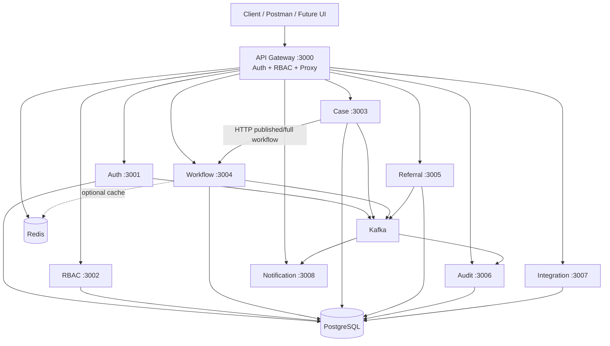

# IACMS — What Is Built and How It Works

This document explains **what the system does**, **what is implemented today**, and **why** the architecture is shaped this way. It is written at a **medium technical** level: enough detail for developers and stakeholders, without walking line-by-line through the code.

For a phase-by-phase checklist against the roadmap, see [`PHASE_STATUS.md`](PHASE_STATUS.md). For API specifics, see [`DOCUMENTATION.md`](DOCUMENTATION.md).

---

## 1. What problem IACMS solves

Government and partner agencies need to manage **cases** (incidents, applications, investigations) in a **consistent process**, not as free-form status fields in a spreadsheet.

IACMS provides:

- **Multi-tenancy** — each agency (tenant) has isolated data, with controlled **cross-agency referrals** when a case must be handled elsewhere.
- **Workflow-driven cases** — every case follows a **published process**: steps (states) and transitions (allowed moves), with optional **role-based** rules on who may execute a transition.
- **Auditability** — security-relevant actions emit structured events that land in an **immutable audit log**, including cross-tenant visibility where referrals are involved.
- **Integration-ready APIs** — a single **API Gateway** for authentication, authorization, and routing to specialized microservices.

---

## 2. Technology stack (why these choices)

| Layer | Technology | Why |
|--------|------------|-----|
| Runtime | **Node.js 20+** (ES modules) | One language across services; good fit for I/O-heavy APIs and Kafka consumers. |
| HTTP | **Express 5** | Familiar, lightweight; each service exposes a small REST surface. |
| Database | **PostgreSQL 15** | Relational model fits workflows (steps, transitions, FKs), cases, and audit rows; strong multi-tenant indexing story. |
| ORM | **Prisma 6** | Single schema at repo root (`prisma/schema.prisma`); type-safe queries; migrations for team alignment. |
| Cache / sessions | **Redis 7** (`ioredis`, `connect-redis`) | Gateway **sessions** for browsers; optional **RBAC permission cache**; optional **workflow definition cache** for hot reads. |
| Events | **Apache Kafka** via **KafkaJS** | Durable, replayable inter-service events (audit, notifications, domain signals) instead of fragile in-memory pub/sub. |
| Auth | **JWT** + **bcrypt** | Stateless API clients use Bearer tokens; passwords hashed; optional Redis-backed login lockout in auth-service. |
| Email | **Nodemailer** | notification-service reacts to auth-related Kafka topics. |
| Audit validation | **Ajv** + JSON Schema | audit-service rejects malformed `audit.log` payloads before persisting. |
| Deploy | **Docker Compose** | Local and demo stacks: Postgres, Redis, Zookeeper, Kafka, and service containers (when images build successfully). |

The repo is an **npm workspace** monorepo: shared code lives under `shared/`, business services under `services/`, one consolidated Prisma schema at the root.

### 2.1 What these technologies are (and why IACMS uses them)

#### PostgreSQL — the system of record

**What it is:** A relational database: tables, rows, foreign keys, transactions, and SQL queries.

**Why we use it:** Cases, workflows, users, roles, and audit rows are strongly related (a case points at a workflow step; history points at transitions). Postgres gives **ACID transactions** (e.g. execute transition + write history in one go), **indexes** for tenant-scoped lists, and a mature ops story. All microservices that own data talk to the **same** Postgres instance in dev (one logical database, shared `prisma/schema.prisma`).

---

#### Prisma — how services talk to Postgres

**What it is:** An ORM (Object–Relational Mapper): you define models in `prisma/schema.prisma`, run migrations, and call a generated **`PrismaClient`** in Node instead of hand-writing every SQL statement.

**Why we use it:** One schema for the whole platform, versioned migrations, and consistent queries across auth, case, workflow, referral, and audit services. Relations (`include: { currentStep: true }`) and `$transaction()` match how the domain is modeled.

---

#### Redis — fast in-memory store

**What it is:** An in-memory key–value server. Data can expire (TTL); reads and writes are very fast compared to disk databases.

**Why we use it in IACMS (three roles):**

| Use | Where | Why |
|-----|--------|-----|
| **Sessions** | API Gateway | Browser clients use cookies; session state (logged-in user) lives in Redis so any gateway instance can validate the session without hitting Postgres on every request. |
| **RBAC cache** | API Gateway | Permission lists for a user are cached briefly so every API call does not call rbac-service. |
| **Workflow cache** | workflow-service (optional) | Published workflow `full` JSON can be cached for hot reads; if Redis is down, the service falls back to Postgres. |

Redis is **not** the source of truth for cases or workflows — Postgres is. Redis is for **speed** and **ephemeral** or **cacheable** data.

---

#### Apache Kafka — event bus between services

**What it is:** A **distributed log** of messages (events). Producers append to **topics** (e.g. `audit.log`, `case.transitioned`); consumers read at their own pace. Messages are **durable** (stored on disk) and can be replayed. **Zookeeper** (in our Compose stack) helps the Kafka broker coordinate cluster metadata in older/single-broker setups.

**Why we use it instead of only HTTP or Redis pub/sub:**

- **Decouple services** — case-service can finish the HTTP response and still emit `audit.log`; audit-service writes the row when it is ready.
- **Durability** — if audit-service is down, events stay in Kafka until it catches up (unlike fire-and-forget HTTP or Redis pub/sub, which can drop messages).
- **Multiple subscribers** — the same event can feed **audit-service** and **notification-service** without the producer knowing every consumer.
- **Clear contracts** — topic names and payloads are documented in `shared/utils/eventBus.js` and `shared/contracts/`.

**Typical flow:** User executes a transition → case-service updates Postgres → publishes to Kafka → audit consumer validates (Ajv) and inserts `AuditLog`; notification consumer may send email or log a stub.

**Note:** If Kafka is unavailable, producers are designed to **fail open** (log a warning; API still succeeds) so dev is not blocked; production should treat Kafka as required for a complete audit trail.

---

#### API Gateway + reverse proxy — one front door

**What it is:** The only public HTTP entry (port 3000). It **authenticates**, checks **RBAC**, then **reverse-proxies** the request to the correct microservice based on the URL path (`/api/v1/cases` → case-service, etc.).

**Why we use it:** Clients see one base URL and CORS policy; services stay internal; shared headers (`x-user-id`, `x-tenant-id`, `x-user-roles`) avoid re-implementing auth in every service.

---

#### JWT + bcrypt — identity

**What it is:** **JWT** (JSON Web Token) — a signed token the client sends as `Authorization: Bearer …` so the gateway knows who is calling. **bcrypt** — slow password hashing so stolen DB dumps are harder to crack.

**Why we use it:** Mobile, Postman, and API clients are stateless; browsers can use **sessions** (Redis) instead. Passwords are never stored in plain text.

---

#### Ajv + JSON Schema — safe audit ingestion

**What it is:** **Ajv** validates JSON documents against a schema (`shared/contracts/audit-event.schema.json`).

**Why we use it:** Kafka messages can be malformed or from a buggy producer; rejecting bad payloads before insert keeps the audit store trustworthy.

---

#### Docker Compose — local full stack

**What it is:** One file (`infrastructure/docker-compose.yml`) to start Postgres, Redis, Zookeeper, Kafka, and optionally service containers together.

**Why we use it:** Developers get the same dependencies without manual installs; demos match production-shaped topology (DB + bus + cache).

---

#### Node.js + Express — service runtime

**What it is:** **Node.js** runs JavaScript on the server; **Express** routes HTTP to handlers.

**Why we use it:** I/O-heavy APIs (DB, Kafka, HTTP to workflow-service) fit Node’s async model; one language and shared `shared/` code across nine services.

---

For Kafka topic lists and ops commands, see [`KAFKA_INTEGRATION.md`](KAFKA_INTEGRATION.md). For event shapes, see [`shared/contracts/`](../shared/contracts/).

---

## 3. Architecture in one picture

**Request path (typical):**

1. Client calls **`http://localhost:3000/api/v1/...`** (gateway).
2. Gateway authenticates (JWT or session), loads **permissions + role IDs** from RBAC (cached in Redis), checks route permission map.
3. Gateway proxies to the target service and adds headers: **`x-user-id`**, **`x-tenant-id`**, **`x-user-roles`** (comma-separated role UUIDs).
4. Target service runs Prisma queries scoped to the tenant (and referral rules for cases), returns JSON.

**Event path (typical):**

1. A service publishes to a Kafka **topic** (e.g. `case.created`, `audit.log`).
2. **audit-service** consumes `audit.log`, validates schema, writes `AuditLog` rows.
3. **notification-service** consumes user/case/referral topics (email for auth; stubs for many domain events).

Canonical topic names live in [`shared/utils/eventBus.js`](../shared/utils/eventBus.js). Event shapes for critical flows are documented under [`shared/contracts/`](../shared/contracts/).

---

## 4. What each service does

| Service | Port | Responsibility |
|---------|------|----------------|
| **API Gateway** | 3000 | Single entry point; CORS; rate limits; session cookies; JWT validation; RBAC gate; reverse proxy to all backends; forwards identity headers. |
| **Auth Service** | 3001 | Users, tenants, login/register, JWT refresh, password reset/change, profile, admin user CRUD; publishes auth and **`audit.log`** events. |
| **RBAC Service** | 3002 | Roles, permissions, user–role assignment; answers “what can this user do?” and returns **`roleIds`** for transition checks. |
| **Workflow Service** | 3004 | Workflow definitions: draft steps/transitions, publish with invariants, version fork, archive; **`GET /workflows/:id/full`** and **`GET /workflows/published`**; optional Redis cache of published full JSON. |
| **Case Service** | 3003 | Cases bound to published workflows; tenant-scoped case numbers; CRUD; assignments/attachments; **transition engine**; **`GET /cases/:id/state`**; calls workflow-service over HTTP. |
| **Referral Service** | 3005 | Cross-agency referrals (create, accept, reject, complete); updates case ownership fields; Kafka + audit with **`relatedTenantId`**. |
| **Audit Service** | 3006 | Consumes **`audit.log`**; Ajv validation; query APIs (including case trail, user actions, compliance CSV export). |
| **Integration Service** | 3007 | Integrations and webhooks CRUD (foundation for external systems). |
| **Notification Service** | 3008 | Kafka consumer; sends email for auth flows; logs stubs for case/workflow/referral notifications. |

---

## 5. What is built — by capability

### 5.1 Identity and access

**Built:**

- Login with **tenant code** (e.g. `TEST-ORG`), JWT access + refresh tokens.
- Gateway **session** flow for browser clients (Redis-backed).
- Admin APIs to manage users within a tenant (create, update, deactivate, assign role).
- RBAC permission checks on gateway routes (e.g. `cases:create`, `workflows:read`, `audit:read`).
- Gateway forwards **`x-user-roles`** so the case engine can enforce **per-transition** `allowedRoleIds` without calling RBAC on every click.

**Why:**

- Central gateway avoids duplicating auth in nine services.
- Role IDs on the wire keep transition authorization **local to the engine** (low latency, clear contract).

### 5.2 Workflow definitions (the “process blueprint”)

**Built:**

- Workflows are rows with **`key`**, **`version`**, and **`status`**: `DRAFT` → `PUBLISHED` → `ARCHIVED`.
- **Steps** (`WorkflowStep`): keys, names, initial/final flags, order, optional `allowedRoleIds`.
- **Transitions** (`WorkflowTransition`): named edges between steps; optional comment/attachment requirements; optional `allowedRoleIds`.
- **Publish** runs **`assertPublishable`** (e.g. exactly one initial step, at least one final, reachable graph, no invalid self-loops).
- **Immutable published version** for case binding; **new-version** creates a new draft fork; **archive** retires old published versions when a newer one exists.
- **`GET /workflows/:id/full`** returns the canonical JSON projection (steps + transitions) used by case-service and documented in `shared/contracts/`.

**Why:**

- Separating **definition** (workflow-service) from **execution** (case-service) lets two teams evolve APIs independently with a frozen contract (`/full` + fixtures).
- Draft vs published prevents agencies from changing a live process under active cases without versioning.

### 5.3 Cases (the “running work”)

**Built:**

- **Create case** with **`workflowKey`** → resolves **highest published** workflow for caller’s tenant → sets **`workflowId`**, **`workflowVersion`**, **`currentStepId`** to initial step.
- **Case numbers** like `TEST-ORG-2026-00002` via **`CaseSequence`** (per tenant + year).
- **Updates** only touch business fields (title, description, `data`, priority) — **not** the current step (that is engine-only).
- **Soft delete** only when the case is on a **final** step.
- **Tenant scoping** (see §6): read vs write rules support referrals.
- **Transition engine**: `POST /cases/:id/transitions/:transitionId/execute` validates step, optional comment/attachment, roles; writes **`CaseHistory`**; sets **`closedAt`** on final steps; publishes **`case.transitioned`** and **`audit.log`**.
- **`GET /cases/:id/state`**: current step, available transitions for the actor, history timeline.
- HTTP client to workflow-service for **published** and **full** definitions.

**Why:**

- Cases must **snapshot** `workflowVersion` at creation so later workflow edits do not rewrite history.
- A single execute endpoint guarantees every step change is validated and audited the same way.

### 5.4 Cross-agency referrals

**Built:**

- Referral records (`CaseReferral`) with lifecycle: pending → accepted / rejected → completed.
- On accept, **`Case.currentTenantId`** moves to receiving agency; originating agency keeps read visibility via query rules.
- Kafka: `referral.created`, `referral.accepted`, `referral.rejected`, `referral.completed`.
- Audit rows use **`relatedTenantId`** so compliance views can show both sides of a handoff.

**Why:**

- Referrals are a distinct bounded context (referral-service) but case visibility rules live in case-service queries — avoids duplicating case logic in two writers.

### 5.5 Audit and compliance

**Built:**

- Producers (auth, case, workflow, referral) emit **`audit.log`** with `tenantId`, `entityType`, `entityId`, `action`, optional **`oldValues` / `newValues`**, optional **`relatedTenantId`**.
- Consumer validates against **`shared/contracts/audit-event.schema.json`** (Ajv).
- Query: logs by case trail, user actions, compliance CSV by tenant.

**Why:**

- Async audit via Kafka keeps user-facing request latency low while preserving a durable trail.
- Schema validation prevents poison messages from corrupting the audit store.

### 5.6 Shared platform pieces

**Built:**

- **`shared/contracts/`** — markdown contracts + JSON fixtures (workflow-full, audit event, case transitioned, referral events).
- **`shared/common/errors.js`** — typed errors (`WorkflowNotPublishedError`, `TenantMismatchError`, `InvalidTransitionError`, …).
- **`shared/utils/eventBus.js`** — Kafka producer/consumer helper used across services.
- Root **`prisma/seed.js`** — test tenant, users, roles, example published workflow `standard-case`.

**Why:**

- Contracts and fixtures are the integration glue between microservices and tests; they prevent “mock drift” from production responses.

---

## 6. Data model (medium detail)

Core entities and why they exist:

| Entity | Role |
|--------|------|
| **Tenant** | Agency / organization; root of isolation. |
| **User**, **Role**, **Permission** | Identity and RBAC; roles may be tenant-scoped or system-wide. |
| **Workflow** | Versioned process definition per tenant + `key`. |
| **WorkflowStep** / **WorkflowTransition** | Graph structure for the engine (not only JSON blob). |
| **Case** | Instance of work; points at workflow + version + **current step**; tracks **originating** vs **current** tenant for referrals. |
| **CaseHistory** | Append-only record of each transition (who, when, from/to step). |
| **CaseSequence** | Safe per-tenant case number generation. |
| **CaseReferral** | Handoff metadata between tenants. |
| **AuditLog** | Immutable-style log of actions; **`relatedTenantId`** for cross-tenant events. |

**Tenant isolation policy (implemented):** explicit Prisma `where` clauses, not PostgreSQL RLS. See [`TENANT_ISOLATION.md`](TENANT_ISOLATION.md).

- **Read** a case if: `tenantId`, `currentTenantId`, or `originatingTenantId` matches caller (referral visibility).
- **Write** a case only if `currentTenantId` matches caller (holder agency).
- Cross-tenant ID probing returns **404** where possible to avoid leaking existence.

**Why not RLS yet:** connection pooling and Prisma make per-request `SET LOCAL` easy to get wrong; application filters are explicit and testable for the current greenfield phase.

---

## 7. Important API surfaces (gateway prefix `/api/v1`)

Examples clients use after login:

| Area | Examples |
|------|----------|
| Auth | `POST /auth/login`, `GET /auth/profile`, admin `/auth/users` |
| Workflows | `GET /workflows`, `GET /workflows/published?key=`, `POST /workflows/:id/publish`, step/transition CRUD on drafts |
| Cases | `POST /cases`, `GET /cases/:id`, `GET /cases/:id/state`, `POST /cases/:id/transitions/:transitionId/execute` |
| Referrals | `POST /referrals`, `POST /referrals/:id/accept`, `.../reject`, `.../complete` |
| Audit | `GET /audit/cases/:caseId`, `GET /audit/users/:userId/actions`, `GET /audit/compliance/:tenantId` |

Postman collections: [`IACMS_Auth_Postman_Collection.json`](../IACMS_Auth_Postman_Collection.json), [`IACMS_Platform_API.postman_collection.json`](../IACMS_Platform_API.postman_collection.json).

---

## 8. What is partially built or not started

| Area | Status | Notes |
|------|--------|--------|
| **Postgres RLS** | Deferred | Documented ADR; app-layer filters only. |
| **Performance / indexes / k6** | Partial | Not a full Phase 8 perf program. |
| **notification-service** domain emails | Stubs | Auth email path exists; case/referral templates mostly log-only. |
| **integration-service** | Foundation | CRUD present; deep sync logic not the focus of workflow engine delivery. |
| **Full DOCUMENTATION.md rewrite** | Partial | Technical reference exists; not every section matches latest code wording. |
| **Docker images for all services** | Fragile | Some Dockerfiles use `npm ci` without per-service lockfiles; local `node` start script is the reliable dev path. |
| **Future (PHASES §14)** | Not started | WebSocket inbox, SMS/push, visual workflow designer UI, per-workflow `Case.data` JSON Schema, audit hash chain. |

---

## 9. How to run and verify locally

1. Start infrastructure: `docker compose up -d postgres redis zookeeper kafka` (from `infrastructure/`).
2. Apply schema + seed: `npx prisma migrate deploy`, `node prisma/seed.js` (see README for `DATABASE_URL` on port **5433**).
3. Start app services: `powershell -File scripts/start-local-services.ps1` from repo root.
4. Smoke: `GET http://localhost:3000/health`, login with seed credentials (`admin@test-org.com` / `password123`, tenant `TEST-ORG`), create a case with `workflowKey: "standard-case"`.

If the database volume predates recent schema changes, you may need to align missing columns or run a clean migrate on a dev database — see operational notes in [`DEFERRED_WORK.md`](DEFERRED_WORK.md).

---

## 10. Summary

**IACMS today** is a **workflow-backed, multi-tenant case platform**: agencies **publish processes**, **open cases** on those processes, **move** them through validated transitions with **role checks**, **refer** work across agencies, and **audit** the trail — exposed through one **gateway** and implemented as **nine Node microservices** on **PostgreSQL**, **Kafka**, and **Redis**, with **shared contracts** tying the pieces together.

The design prioritizes **clear boundaries** (define vs execute vs audit vs notify), **contract-first integration**, and **explicit tenancy** over database magic — with room to harden performance, notifications, and RLS in later phases.
